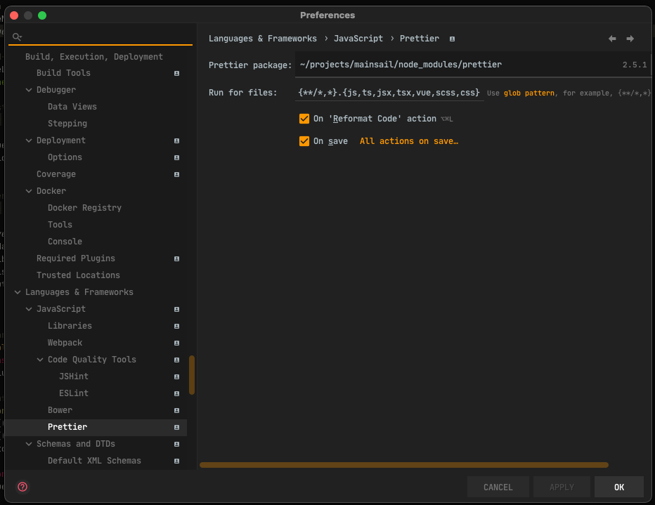

# {{ page.title }}
{{ page.description }}

## Code formatting

For the formatting we currently use [Prettier](https://prettier.io/). 
This is an opinionated code formatter which makes sure that we use the same formatting across the whole codebase. 
To make sure that this is complied with every PR, there is a Github Workflow which checks this on all PRs.

You can always run `npm run format` to make sure that all your changes are formatted correctly.

To make it easier for yourself, you can use the intergrations of the Jetbrains IDE / VSCode applications.

### Jetbrains IDE

Add this integration by:
- Adding the [prettier plugin](https://plugins.jetbrains.com/plugin/10456-prettier) through plugins. 
- Going to Preferences -> Languages and Frameworks -> Prettier.
- Set 'Run for files' to `{**/*,*}.{js,ts,jsx,tsx,vue,scss,css,yml,md,html}`
- Tick the `On save` and `On 'Reformat code' action` boxes

So it looks like this:

### VSCode

Add this integration by:
- Adding the [prettier extension](https://marketplace.visualstudio.com/items?itemName=esbenp.prettier-vscode)
- Setting the `editor.defaultFormatter` preference to `esbenp.prettier-vscode`

## Linting

For linting we use [ESLint](https://eslint.org/). Which statically analyzes our application for common problems. 
Just like our code formatting, this is also checked in every PR using a custom workflow.

You can always run `npm run lint:fix` to make sure that all your changes are in compliant with our linting rules.