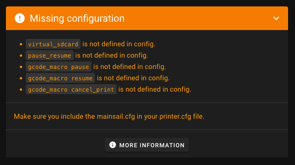

# mainsail.cfg – Setup & Customization

Mainsail needs a few Klipper configuration sections to work correctly. The easiest way to add them is by including the
ready-made `mainsail.cfg` file. This page explains what it provides, how to include it, and how to customize its
behavior.

## What mainsail.cfg provides

Mainsail requires the following Klipper configuration sections to be present in your `printer.cfg`. If they are missing,
Mainsail will warn you on the Dashboard with an orange panel like this:

<figure markdown="span">
  
</figure>

The `mainsail.cfg` file bundles all of them so you don't have to set them up manually:

- `[virtual_sdcard]` – Enables G-code printing from Mainsail. Without it, the G-Code Files page will not be enabled and
  Moonraker won't know where to store uploaded G-code files.
- `[display_status]` – Provides printer status messages shown in Mainsail's status panel. Necessary if you don't
  already have a `[display]` defined.
- `[pause_resume]` – Core Klipper support for pausing and resuming jobs.
- `[gcode_macro PAUSE]` – Defines how a pause behaves in your setup (parking, retract, etc.).
- `[gcode_macro RESUME]` – Defines how to resume a print (restore modes, continue).
- `[gcode_macro CANCEL_PRINT]` – Defines how a cancel behaves (turn off heaters, park, clean-up).

## Include mainsail.cfg

With this include, all required configuration sections are automatically added to your `printer.cfg` and you are ready
to print via Mainsail. If you use MainsailOS, this file is already present on your system. To check if it is there, you
can use the Mainsail File Manager to look for `mainsail.cfg` in your Config Files folder.

To use it, simply add this line to your `printer.cfg`:

```ini
[include mainsail.cfg]
```

!!! tip
    The default configuration shipped by MainsailOS comes from the mainsail-config repository. You can browse it here:
    [https://github.com/mainsail-crew/mainsail-config](https://github.com/mainsail-crew/mainsail-config/){:target="_blank"}

## Customize mainsail.cfg

MainsailOS ships `mainsail.cfg` (client configuration) as a read‑only include. Do not edit `mainsail.cfg` directly. To
customize its behavior, override the provided variables in your own `printer.cfg` by adding the special macro
`_CLIENT_VARIABLE`.

Setting up `_CLIENT_VARIABLE`:

1. Copy the `_CLIENT_VARIABLE` macro from `mainsail.cfg` into your `printer.cfg`.
2. Remove the `#` comment markers from the first line, the last line (`gcode:`), and the variables you want to
   customize.
3. Adjust the values to fit your printer and preferences, then press `SAVE & RESTART` in the editor.

```ini title="Minimal example: Override park position"
[gcode_macro _CLIENT_VARIABLE]
variable_use_custom_pos   : True
variable_custom_park_x    : 10.0
variable_custom_park_y    : 10.0
variable_custom_park_dz   : 5.0
gcode:
```

!!! note
    The last line `gcode:` is required to define a gcode macro, even if it is empty. This is necessary for Klipper to
    parse the configuration correctly.

## Reuse the PAUSE macro

You can reuse the PAUSE macro defined in `mainsail.cfg` in your own custom macros. This allows you to maintain a single
source of truth for how pausing works in your setup while still customizing it for specific use cases. For example, you
can call the PAUSE macro with different parameters to change the parking position or minimum Z height for specific
filament change scenarios.

```ini title="Example for M600 filament change macro with custom park position and minimum Z height"
[gcode_macro M600]
description: Filament change
gcode: PAUSE X=10 Y=10 Z_MIN=50
```

This calls the `PAUSE` macro defined in `mainsail.cfg` but overrides the park position to X=10, Y=10 and sets the
minimum Z height to 50 mm.
