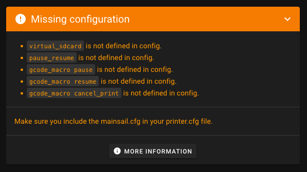

# Required Configuration for Mainsail

Mainsail needs a few Klipper configuration sections to enable all Klipper features which are needed to enable all
Mainsail functions. If they are missing, Mainsail will warn you on the Dashboard with an orange panel like this:

<figure markdown="span">
  
</figure>

## Required modules
Mainsail requires the following Klipper configuration sections to be present in your `printer.cfg`:

- `[virtual_sdcard]`: Enables G-code printing from Mainsail. Without it, the G-Code Files page will not be enabled and
  Moonraker don't know where to store uploaded G-code files.
- `[display_status]`: Provides printer status messages shown in Mainsail’s status panel. Necessary if you don’t
  already have a `[display]` defined.
- `[pause_resume]`: Core Klipper support for pausing and resuming jobs.
- `[gcode_macro PAUSE]`: Defines how a pause behaves in your setup (parking, retract, etc.).
- `[gcode_macro RESUME]`: Defines how to resume a print (restore modes, continue).
- `[gcode_macro CANCEL_PRINT]`: Defines how a cancel behaves (turn off heaters, park, clean-up).

All these settings are pre-configured in the `mainsail.cfg` file provided with MainsailOS (or also with KIAUH). You can
include it in your `printer.cfg` to get everything set up quickly.

## Include mainsail.cfg

With this include, all required configuration sections are automatically added to your `printer.cfg` and you are ready
to print via Mainsail. If you use MainsailOS, this file is already present on your system. To check if it is there, you
can use the Mainsail File Manager to look for `mainsail.cfg` in your Config Files folder.  
  
To use it, simply add this line to your `printer.cfg`:
```ini
[include mainsail.cfg]
```

!!! tip
    The default configuration shipped by MainsailOS comes from the mainsail-config repository. You can browse it here:
    [https://github.com/mainsail-crew/mainsail-config](https://github.com/mainsail-crew/mainsail-config/blob/master/client.cfg){target="_blank"}

!!! note "Customizing mainsail.cfg"
    You can customize the behavior provided by `mainsail.cfg` without editing it directly. See the optional
    customization guide for `_CLIENT_VARIABLE` examples and advanced command overrides:
    [Optional customization](optional.md)
