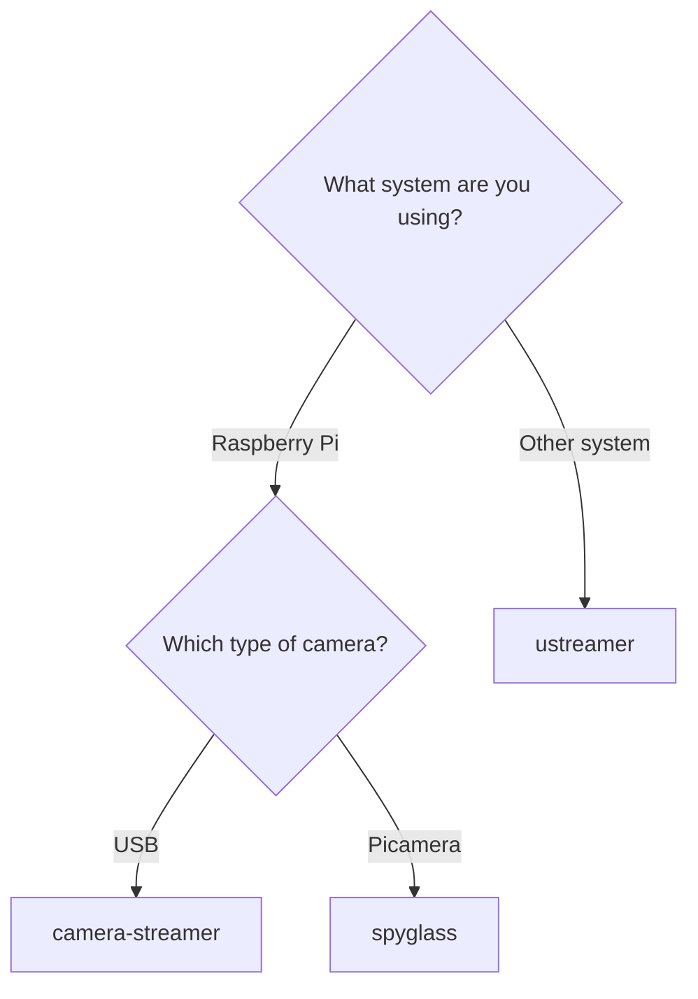

# Crowsnest Backends

Crowsnest supports multiple backends for video streaming. This section provides details on the available options and their configuration.

## µStreamer (PiKVM)

[µStreamer](https://github.com/pikvm/ustreamer) is a lightweight and highly efficient MJPEG streaming server. It is developed by [Maxim Devaev](https://github.com/mdevaev) as part of the [PiKVM](https://github.com/pikvm/pikvm) project.

- **Project Link:** [GitHub - pikvm/ustreamer](https://github.com/pikvm/ustreamer)

To use this backend, set `mode: ustreamer` in your `crowsnest.conf`.

> **Note:** The legacy setting `mode: mjpg` is also supported but `ustreamer` is recommended.

## camera-streamer (ayufan)

[camera-streamer](https://github.com/ayufan/camera-streamer) is a low-latency streaming server that supports fully hardware-accelerated MJPEG and H.264 video streams on Raspberry Pis. It is maintained by [Kamil Trzciński (ayufan)](https://github.com/ayufan).

- **Project Link:** [GitHub - ayufan/camera-streamer](https://github.com/ayufan/camera-streamer)

To use this backend, set `mode: camera-streamer` in your `crowsnest.conf`.

!!! info "Compatibility"
    camera-streamer supports WebRTC only on Raspberry Pi SBCs, excluding Pi5. We install it on all Debian based systems through our [apt repository](https://apt.mainsail.xyz/), but recommend ustreamer on non Raspberry Pi SBCs.

## spyglass (mainsail-crew)

[spyglass](https://github.com/mainsail-crew/spyglass) is a low-latency streaming server that supports fully hardware-accelerated MJPEG and H.264 video streams for Picameras on Raspberry Pis. It was initially developed by [roamingthings](https://github.com/roamingthings) and [Mr Yel](https://github.com/mryel00), now maintained by [Mr Yel](https://github.com/mryel00) under the flag of the [mainsail-crew](https://github.com/mainsail-crew/).

- **Project Link:** [GitHub - mainsail-crew/spyglass](https://github.com/mainsail-crew/spyglass)

To use this backend, set `mode: spyglass` in your `crowsnest.conf`.

!!! info "Compatibility"
    Currently, `spyglass` is only available for Picameras on Raspberry Pi SBCs.

### Pi5 specifics
`spyglass` supports Pi5, but due to hardware limitations (no hardware encoders), CPU usage may be high without specific settings.

## Which backend should I choose?
This flowchart outlines our recommendations for most users.

