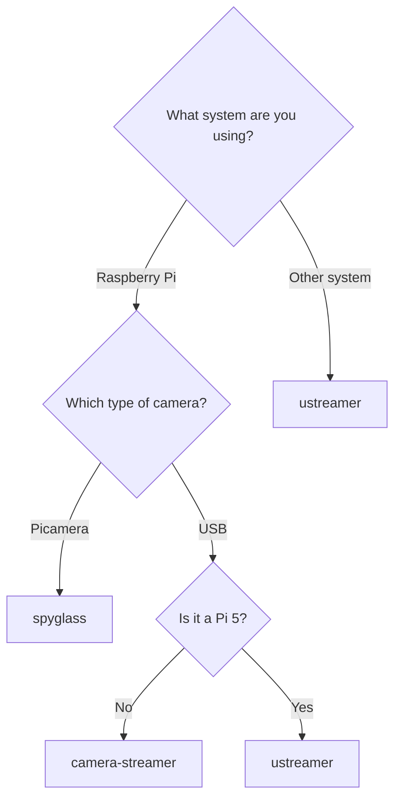

# Crowsnest Backends

Crowsnest supports multiple backends for video streaming. This section provides details on the available options and
their configuration.

## µStreamer (PiKVM)

[µStreamer](https://github.com/pikvm/ustreamer){:target="_blank"} is a lightweight and highly efficient MJPEG streaming
server. It is developed by [Maxim Devaev](https://github.com/mdevaev){:target="_blank"} as part of the
[PiKVM](https://github.com/pikvm/pikvm){:target="_blank"} project.

- **Project Link:** [GitHub - pikvm/ustreamer](https://github.com/pikvm/ustreamer){:target="_blank"}

µStreamer streams via the MJPG protocol, which transmits a continuous series of JPEG images. This makes it universally
compatible but bandwidth-intensive — especially at higher resolutions and frame rates. It is the default and most widely
supported mode.

To use this backend, set `mode: ustreamer` in your `crowsnest.conf`.

## camera-streamer (ayufan)

[camera-streamer](https://github.com/ayufan/camera-streamer){:target="_blank"} is a low-latency streaming server
maintained by [Kamil Trzciński (ayufan)](https://github.com/ayufan){:target="_blank"}.

- **Project Link:** [GitHub - ayufan/camera-streamer](https://github.com/ayufan/camera-streamer){:target="_blank"}

The feature set depends on the hardware. On Raspberry Pi SBCs (excluding Pi 5), camera-streamer leverages the GPU for
hardware-accelerated H.264 encoding, which enables WebRTC streaming. WebRTC delivers significantly lower bandwidth
usage compared to MJPG without sacrificing quality, frame rate, or resolution. On all other devices (including the
Pi 5, which lacks a hardware encoder) only MJPEG streaming is available.

To use this backend, set `mode: camera-streamer` in your `crowsnest.conf`.

!!! tip
    On devices without hardware encoding support, we recommend using µStreamer instead, as it provides the same
    MJPEG streaming with broader compatibility.

## spyglass (mainsail-crew)

[spyglass](https://github.com/mainsail-crew/spyglass){:target="_blank"} is a low-latency streaming server that supports
fully hardware-accelerated MJPEG and H.264 video streams for Pi cameras on Raspberry Pis. It was initially developed by
[roamingthings](https://github.com/roamingthings){:target="_blank"} and
[Mr Yel](https://github.com/mryel00){:target="_blank"}, now maintained by
[Mr Yel](https://github.com/mryel00){:target="_blank"} under the flag of the
[mainsail-crew](https://github.com/mainsail-crew/){:target="_blank"}.

- **Project Link:** [GitHub - mainsail-crew/spyglass](https://github.com/mainsail-crew/spyglass){:target="_blank"}

spyglass is developed and maintained by the Mainsail team, which allows for faster issue resolution without external
dependencies. It is exclusively available on Raspberry Pi SBCs and only supports Pi cameras.

To use this backend, set `mode: spyglass` in your `crowsnest.conf`.

!!! info "Raspberry Pi 5 users"
    Due to hardware limitations (no hardware encoders), spyglass on Pi 5 will use software encoding, which can lead to
    high CPU usage and reduced performance. We recommend using µStreamer instead for Pi 5 devices.

## Which backend should I choose?
This flowchart outlines our recommendations for most users.

