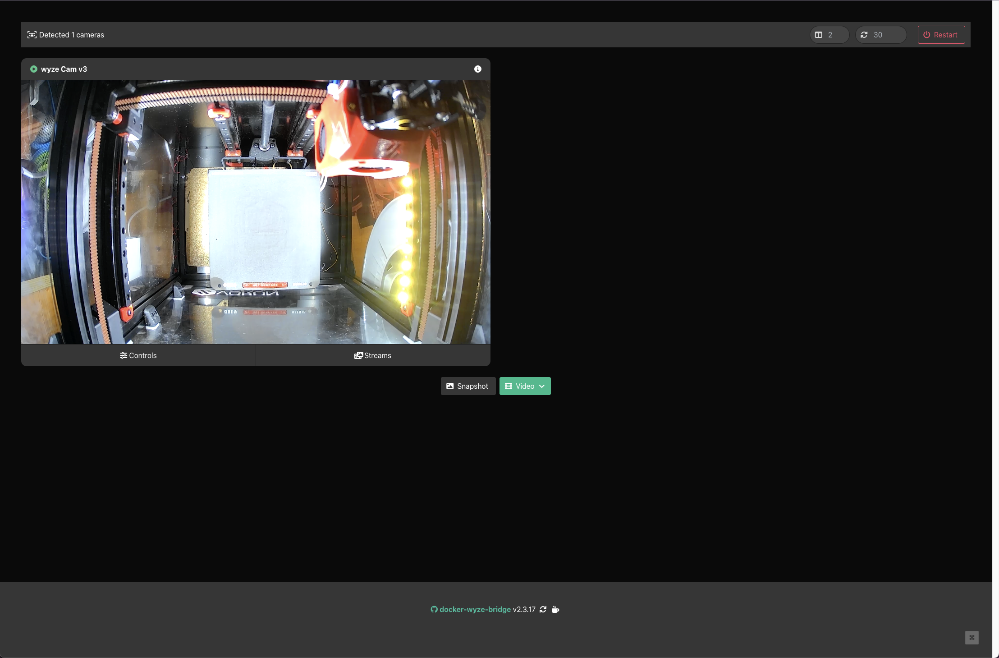
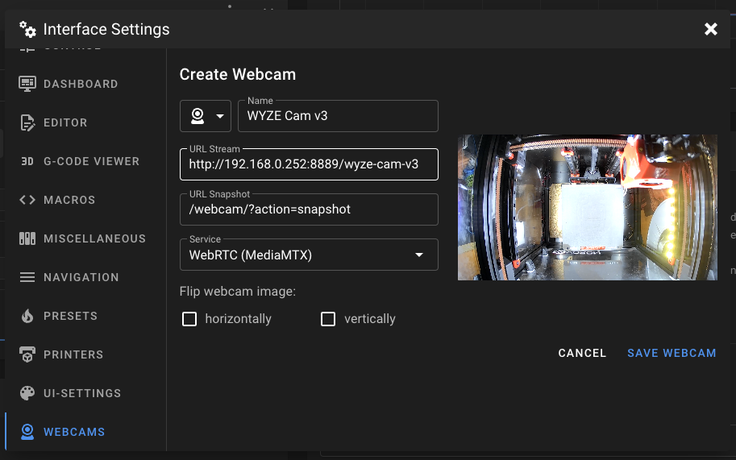

# How to use WYZE-Cams?

Wyze cams are not natively supported, but a separate tool allows WebRTC streaming to Mainsail.

!!! warning
    This tool is not part of Crowsnest, so we will not provide support for it! This is just a guide with all the information we have about this tool to use it with Mainsail.

    Link: [github.com/mrlt8/docker-wyze-bridge](https://github.com/mrlt8/docker-wyze-bridge)

!!! info
    Minimum requirement for embedding this streamer in Mainsail is version 2.8.0.

### Install WYZE-Bridge

WYZE-Bridge is a Docker container with all the software components you need to convert a WYZE-Cam stream to WebRTC. There are multiple ways to install it:

* [docker-compose](https://github.com/mrlt8/docker-wyze-bridge#docker-compose-recommended)
* [Portainer ](https://github.com/mrlt8/docker-wyze-bridge/wiki/Portainer)
* [Home Assistant](https://github.com/mrlt8/docker-wyze-bridge/wiki/Home-Assistant)

!!! info
    If you use a Raspberry Pi as your docker host, you must enable hardware acceleration.

    Link: <https://github.com/mrlt8/docker-wyze-bridge/wiki/Hardware-Acceleration#raspberry-pi>

### Enable WebRTC in WYZE-Bridge

By default, WebRTC is not enabled. To enable it, you only have to add some ports and add an ENV variable in your container config. Here you can find the guide to enable it: <https://github.com/mrlt8/docker-wyze-bridge#webrtc>

### First login in WYZE-Bridge

First, open the WYZE-Bridge web interface with the following URL:

* http://&lt;ip&gt;:5000

When the web interface loads, log in with the same credentials you use in the WYZE app. If everything works and your WYZE account connects to your cam, you should see something like this:

### Setup WYZE-Cam in Mainsail

With WYZE Bridge ready, complete the setup by configuring Mainsail.

First, obtain the correct WebRTC streaming URL. To get this, click on the `Streams` button below the webcam and then on `WebRTC`. A new tab should open. Copy the URL of this tab. This is your WebRTC Stream URL.

Open Mainsail > Interface Settings (gears on the top right) > Webcams and then create a new webcam. Paste the URL in the `URL Stream` field and change the `Service` to `WebRTC (MediaMTX)`. It should look like this:

