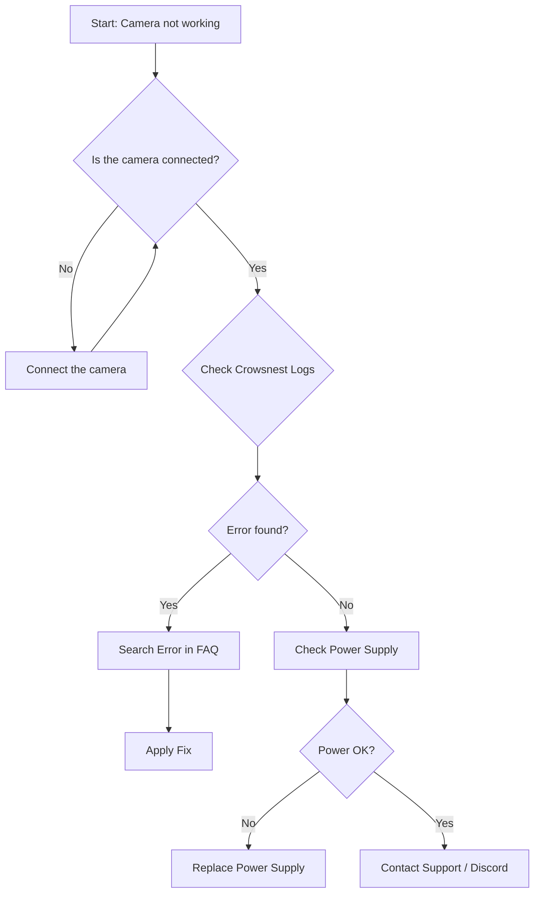

# Troubleshooting

!!! warning "Work in Progress"
    This troubleshooting guide is currently a placeholder and will be expanded in future updates.

## Camera Issues Flowchart

```mermaid
graph TD
    A[Start: Camera not working] --> B{Is the camera connected?};
    B -- No --> C[Connect the camera];
    B -- Yes --> D{Check Crowsnest Logs};
    D --> E{Error found?};
    E -- Yes --> F[Search Error in FAQ];
    E -- No --> G[Check Power Supply];
    C --> B;
    F --> H[Apply Fix];
    G --> I{Power OK?};
    I -- No --> J[Replace Power Supply];
    I -- Yes --> K[Contact Support / Discord];
```
