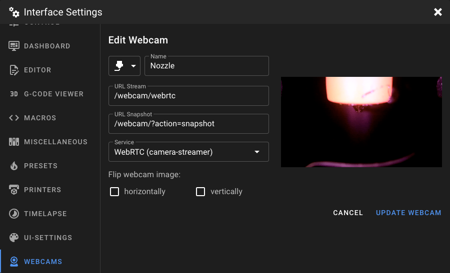

# WebRTC

To use `WebRTC`, replace `?action=stream` with `webrtc` in your webcam URL configuration.

!!! note
    This feature only works if you are using `mode: camera-streamer` or `mode: spyglass` on a Raspberry Pi excluding Pi5.

!!! warning
    Do not change the `URL Snapshot` setting! It should remain the same as before.

## Which service should I choose?

There are multiple different WebRTC services you can choose in Mainsail. Which service you should choose depends on the mode you have set for the camera in your `crowsnest.conf`:  

- `camera-streamer` choose `WebRTC (camera-streamer)`
- `spyglass` choose `WebRTC (MediaMTX)`
