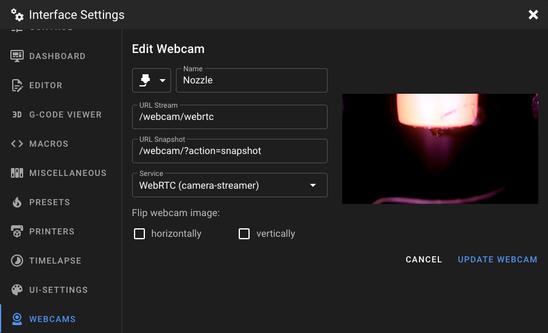

# WebRTC

To use WebRTC, replace `?action=stream` with `webrtc` in your webcam URL configuration.

!!! note
    This feature only works if you are using `mode: camera-streamer` or `mode: spyglass` on a Raspberry Pi.

!!! info "Raspberry Pi 5 users"
    Due to hardware limitations (no hardware encoders), crowsnest will disable WebRTC on the Pi 5. You can enable it
    again by setting `mode: spyglass` and `custom_flags: --no-disable_webrtc`, but we advise against this.
    There is no support for `mode: camera-streamer` on the Pi 5!

!!! warning
    Do not change the **URL Snapshot** setting! It should remain the same as before.

## Which service should I choose?

Mainsail offers multiple WebRTC services. The correct choice depends on the mode you have set for the camera
in your `crowsnest.conf`:

| Mode in `crowsnest.conf` | WebRTC Service in Mainsail |
|--------------------------|----------------------------|
| `camera-streamer`        | `WebRTC (camera-streamer)` |
| `spyglass`               | `WebRTC (MediaMTX)`        |
