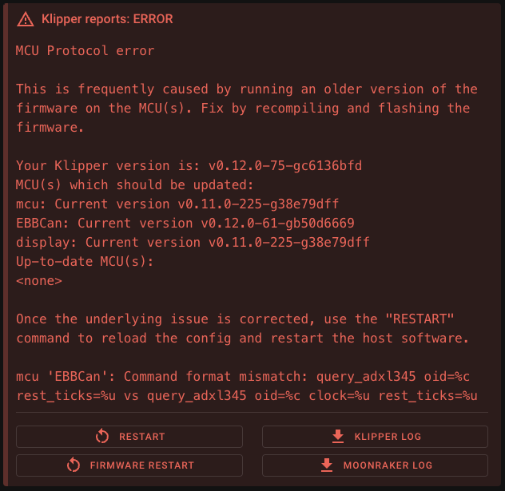

# MCU Protocol error

From time to time it happens that there are changes in the Klipper communication between host and MCU. That make it
necessary to update all your MCUs to fix the communication error.

## Description of the error message

<figure markdown="span">

<figcaption>Screenshot of the "MCU Protocol error" message</figcaption>
</figure>

In the middle of the error message, all MCUs are listed with their current version. In my case, you can see the Klipper
version on the host is `v0.12.0-75-gc6136bfd`.

Directly below the current Klipper version is a list of all MCUs that still need to be updated. In my case, these are:

- **mcu:** Current version `v0.11.0-225-g38e79dff`
- **EBBCan:** Current version `v0.12.0-61-gb50d6669`
- **display:** Current version `v0.11.0-225-g38e79dff`

It is also common to have a "Linux MCU". This is mostly used when using an accelerometer (ADXL345, LIS2DW,
MPU-6000/9000 series) directly via the GPIO of the Raspberry Pi. This MCU is usually called `rpi`.

After the outdated MCUs follows a list of all the MCUs that have already been updated to the latest version. There
isn't a single one yet, so it says `<none>` here.

## How to compile a new firmware

You must compile a new firmware to flash it onto the MCU. For this, you need the Klipper firmware settings for the
board. These settings can be found in the example file from Klipper:

- [Klipper example configs](https://github.com/Klipper3d/klipper/tree/master/config){:target="_blank"}

To open the Klipper firmware config tool, connect to your printer via SSH and execute the following commands:

```bash
cd ~/klipper
make menuconfig
```

After you have set all the settings, you can close the menu (press the key `q`). To clear the cache and build the new
firmware, execute these commands:

```bash
make clean
make
```

The firmware is now compiled and ready for flashing. The file is in `~/klipper/out/klipper.bin`.

## Flash the firmware onto the board

The compiled firmware must now be flashed onto the board. There are several ways to do this. Unfortunately, there is no
generally valid solution. Most standard boards can be flashed with the following method. At first we have to read the
serial by-id path of the MCU:

```bash
ls /dev/serial/by-id/*
```

The output should look like this:

```
/dev/serial/by-id/usb-Klipper_stm32f042x6_010007000C43565335383320-if00
```

With this serial path, you can execute the flash command:

```bash
sudo systemctl stop klipper
make flash FLASH_DEVICE=<serial path to the board>
sudo systemctl start klipper
```

If this command does not work for your board, other options exist. First, you can reread the example configuration to
see if your board has another description to flash the board.

- [Klipper SD-Card Updates](https://www.klipper3d.org/SDCard_Updates.html){:target="_blank"}
  If a board has already been flashed with Klipper and has a sd card slot, the firmware can be transferred to the sd
  card in the slot via the board connection and flashed.
- [Katapult](https://github.com/Arksine/katapult){:target="_blank"}
  Katapult is an alternative bootloader for printer boards. This bootloader is very popular with CAN Toolhead boards.
  The current board connection can also be used to flash the firmware to the MCU.

## Need help?

If, despite these instructions, you still have problems flashing your board or cannot find a config for your board/MCU,
please get in touch with your Klipper/Printer Discord/Forum or visit our [Getting Help](../../getting-help/index.md)
page for all Mainsail community channels.
