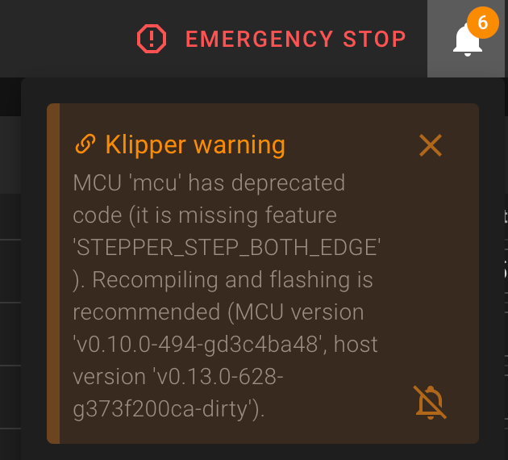

# Deprecated MCU Code

Klipper consists of two parts: the host software running on your Raspberry Pi (or any other host) and the firmware
running on your MCUs (mainboard, toolhead board, display, Linux MCU, etc.). Both parts are updated together, but the
MCU firmware has to be compiled and flashed manually after a Klipper update.

If the host software has been updated but an MCU is still running an older firmware, Klipper shows this warning:

<figure markdown="span">

<figcaption>"Deprecated MCU Code" warning in the Notifications</figcaption>
</figure>

## Description of the warning message

The message always follows the same pattern:

```
MCU '<mcu name>' has deprecated code (it is missing feature '<feature name>'). Recompiling and flashing is
recommended (MCU version '<mcu version>', host version '<host version>').
```

- **`<mcu name>`** is the name of the MCU as configured in your `printer.cfg`. In the screenshot above it is `mcu`,
  which is the primary mainboard. Other common names are `EBBCan` (a CAN toolhead board), `display` or `rpi`
  (a Linux MCU, mostly used for an accelerometer connected to the GPIO of the host).
- **`<feature name>`** is the internal name of a firmware feature the host software wants to use, but which is not
  available in the currently flashed firmware. Examples are `STEPPER_STEP_BOTH_EDGE` or `spi_set_sw_bus`. You do not
  have to know what these features do, the fix is always the same.
- **`<mcu version>`** and **`<host version>`** show the currently flashed firmware version and the version of the
  Klipper host software. If both differ, the MCU firmware is outdated.

!!! info
    This message is only a warning, not an error. Your printer keeps working, but Klipper has to fall back to an
    older and often less efficient implementation. Depending on the missing feature this can, for example, limit the
    maximum step rate of your steppers.

## How to fix it

Recompile the firmware for the MCU mentioned in the warning and flash it onto the board. The procedure is exactly the
same as described on the [MCU Protocol error](../klipper_errors/command-format-mismatch.md) page:

1. [Compile a new firmware](../klipper_errors/command-format-mismatch.md#how-to-compile-a-new-firmware) with the
   settings for your board.
2. [Flash the firmware onto the board](../klipper_errors/command-format-mismatch.md#flash-the-firmware-onto-the-board).

Repeat this for every MCU listed in a warning. Afterward, restart Klipper. If all MCUs run the same version as the
host, the warning disappears.

!!! warning
    Make sure to use the firmware settings of the correct board. Every MCU (mainboard, toolhead board, display, ...)
    needs its own firmware. Flashing a firmware built for a different board can leave the board unusable until it is
    reflashed via its bootloader.

## Need help?

If you have problems compiling or flashing your board, or cannot find the firmware settings for your board, please
get in touch with your Klipper/Printer Discord/Forum or visit our [Getting Help](../../getting-help/index.md) page
for all Mainsail community channels.
