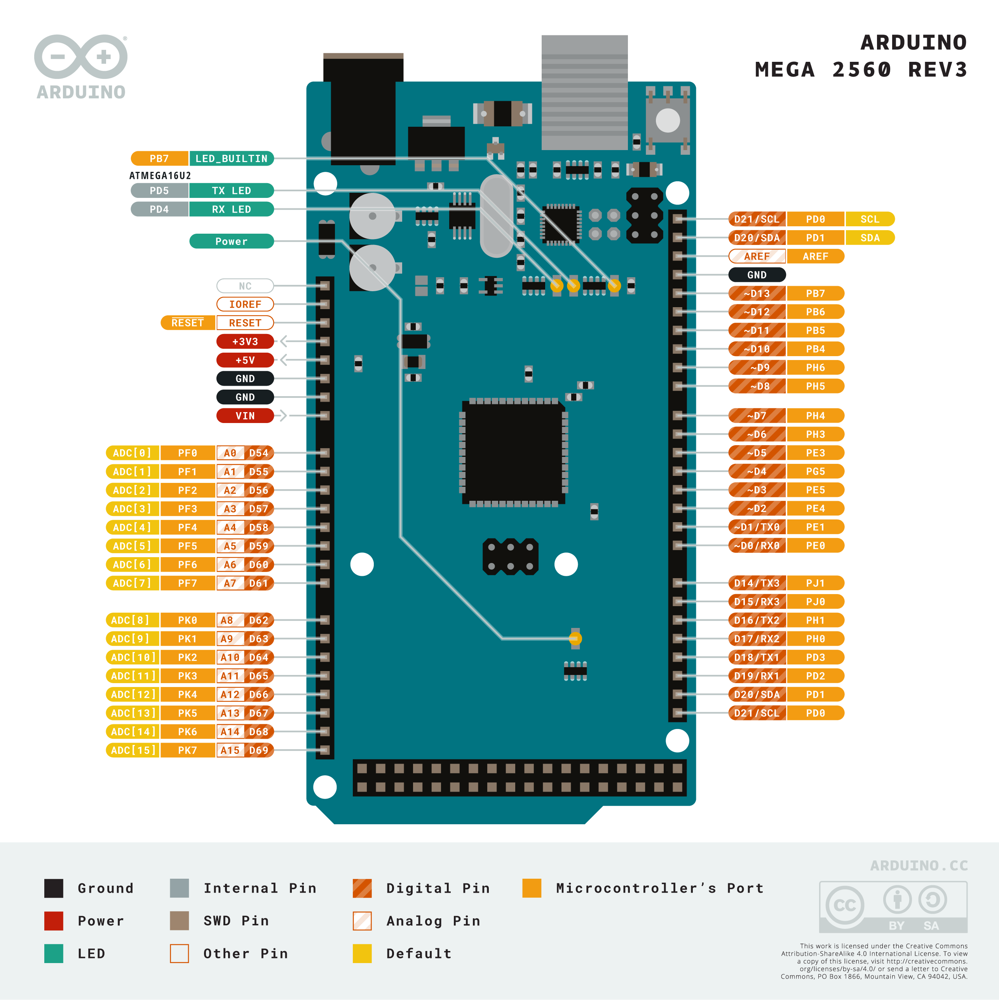

# Deprecated Options

Klipper occasionally deprecates configuration options as the firmware evolves. When this happens, Klipper will display
a warning message during startup, indicating that your `printer.cfg` contains outdated options that need to be updated.

Below you can find a list of commonly encountered deprecated options along with step-by-step instructions on how to
fix them. For a complete list of all configuration changes, refer to the official
[Klipper Configuration Changes](https://www.klipper3d.org/Config_Changes.html){:target="_blank"} documentation.

### Removal of `relative_reference_index` { #relative_reference_index }

The `relative_reference_index` option has been deprecated and superseded by the `zero_reference_position` option.
Refer to the
[Bed Mesh Documentation](https://www.klipper3d.org/Bed_Mesh.html#the-deprecated-relative_reference_index){:target="_blank"}
for details on how to update the configuration. With this deprecation the `RELATIVE_REFERENCE_INDEX` is no longer
available as a parameter for the `BED_MESH_CALIBRATE` G-Code command.

[Source](https://www.klipper3d.org/Config_Changes.html){:target="_blank"}

### Removal of `default_parameter_` for G-Code macros. { #default_parameter }

In the past, default parameters for G-Code macros were defined like so:

```ini
[gcode_macro PRINT_START]
default_parameter_EXTRUDER: 230
gcode:
  ...
```

This would define a macro called `PRINT_START` that can be called with an `EXTRUDER` parameter like so:
`PRINT_START EXTRUDER=200`. If no value is passed for `EXTRUDER` the default value of 230 is used. This style of
default parameters has been deprecated. Instead, define your macro like so:

```ini
[gcode_macro PRINT_START]
gcode:
  
```

Take note of the following important aspects:

- Parameters passed to G-Code macros are stored in the `params` object. So if your macro is called with `VALUE=50`,
  `params.VALUE` will contain the value 50. After the deprecation, only the `params` object will contain these values.

- Make sure to name your "set variable" something else as the name of the variable in the `params` object (see how I
  used `EXTRUDER_TEMP` for the "set variable" and `EXTRUDER` for the actual macro parameter above) to avoid confusion
  and possible parsing errors.

- If you want to pass a default, add `|default(<default value>)` to the end of the `params` variable (see above,
  where my default value is 10).

- To ensure that `EXTRUDER_TEMP` will have an integer value, add `|int` to the end of the command, to turn passed
  parameters (if they exist) and the default into an integer. Depending on what kind of parameter you're passing,
  there are `|int` `|float` `|bool` or `|string` converters available. Make sure that you convert to int if you want
  to compare the values in your G-Code macro.

!!! information
    The above description was provided by our community member
    [FHeilmann](https://github.com/FHeilmann){:target="_blank"} and we have his permission to publish it here.
    Thanks a lot!
    [Source](https://gist.github.com/FHeilmann/a8097b3e908e85de7255bbe6246ddfd5){:target="_blank"}

### Removal of `step_distance` { #step_distance }

`step_distance` describes the distance covered by a certain axis with 1 stepper (micro-)step. The downside of this
parameter (and one of the reasons for its removal) is that if one were to change the microstepping of a stepper, the
step_distance changes as well. Klipper therefore removed the `step_distance` parameter in favor of
`rotation_distance` and `full_steps_per_rotation`. These two parameters are unaffected by microstepping, and can be
easily determined by inspecting the used hardware.

Perform the following steps to convert your config:

- comment out the old `step_distance` parameter

- add three new parameters:

    - `full_steps_per_rotation` this is 400 for 0.9 degree stepper motors and 200 for 1.8 degree stepper motors.

    - `rotation_distance` this can be determined either according to hardware, or by converting the old
      `step_distance` using math.

    - `gear_ratio` can additionally be used to describe an axis that uses a reduction gear (like the Voron-2 Z axis)

    - The easiest way to obtain the correct values for `rotation_distance` and `gear_ratio` is to check the official
      Voron printer Github repositories. All example configs have been updated to include the correct values for the
      new parameters. Keep in mind that you'll still have to calibrate your extruder steps/mm if you choose to copy
      the values for the extruder. Instructions on how to convert and recalibrate the extruder values can be found
      [here](https://github.com/Klipper3d/klipper/blob/master/docs/Rotation_Distance.md#extruder){:target="_blank"}.

    - The formulas to convert `step_distance` to `rotation distance` can be found
      [here](https://github.com/Klipper3d/klipper/blob/master/docs/Rotation_Distance.md#obtaining-rotation_distance-from-steps_per_mm-or-step_distance){:target="_blank"}

    - Guidance on how to inspect your hardware to determine your conversion distance can be found
      [here](https://github.com/Klipper3d/klipper/blob/master/docs/Rotation_Distance.md#obtaining-rotation_distance-by-inspecting-the-hardware){:target="_blank"}.
      Make sure to also consider any reduction gearing, if applicable, by checking
      [this section](https://github.com/Klipper3d/klipper/blob/master/docs/Rotation_Distance.md#using-a-gear_ratio){:target="_blank"}
      as well.

    - For every stepper, except your extruder, you should end up with even numbers (e.g. 40 instead of 39.9683).

!!! information
    The above description was provided by our community member
    [FHeilmann](https://github.com/FHeilmann){:target="_blank"} and we have his permission to publish it here.
    Thanks a lot!
    [Source](https://gist.github.com/FHeilmann/a8097b3e908e85de7255bbe6246ddfd5){:target="_blank"}

### Removal of `pin_map` { #pin_map }

For Voron printers, this is only relevant if you're running an Arduino based controller board and use pins named
similar to `ar19` etc. These pin declarations are no longer valid and need to be replaced with their hardware pin
identifiers. To find the appropriate hardware pin identifier perform a google image search for your board plus
`pinout`. E.g.:

`arduino mega 2560 pinout`

which will yield images such as this one:



There, find the pin you're trying to replace. The old pin maps use the digital number of the pin. For example, if
your old pin was `ar10`, looking at the image you will find that the `D10` pin corresponds to `PB4`. Replace all pins
in your config accordingly, and finally remove the `pin_map:` configuration parameter from your `mcu` section.

Alternatively, you can copy an appropriate `[board_pins]` block from
[this location](https://github.com/Klipper3d/klipper/blob/master/config/sample-aliases.cfg){:target="_blank"} to
your config. If you're using multiple Arduinos, make sure to add the appropriate `mcu` to each block like so:

```ini
[board_pins arduino-mega]
mcu: mcu
```

!!! information
    The above description was provided by our community member
    [FHeilmann](https://github.com/FHeilmann){:target="_blank"} and we have his permission to publish it here.
    Thanks a lot!
    [Source](https://gist.github.com/FHeilmann/a8097b3e908e85de7255bbe6246ddfd5){:target="_blank"}

### Removal of `max_accel_to_decel` { #max_accel_to_decel }

The `max_accel_to_decel` option has been deprecated and superseded by the `minimum_cruise_ratio` option. Refer to the
[printer section documentation](https://www.klipper3d.org/Config_Reference.html#printer){:target="_blank"} for
details on how to update the configuration. The `max_accel_to_decel` can be deleted in most cases, as the default
value of `minimum_cruise_ratio` should fit for most of the printers.
