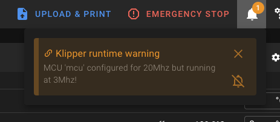

# Runtime Warnings

Klipper can display runtime warnings during operation when it detects potential issues with your configuration or
firmware. Unlike deprecated options, these warnings typically indicate a mismatch between your configuration and the
actual hardware state.

Below you can find a list of commonly encountered runtime warnings along with instructions on how to resolve them.

### MCU '&lt;mcu name&gt;' configured for &lt;X&gt;Mhz but running at &lt;Y&gt;Mhz! { #mcu-frequency-warning }

<figure markdown="span">

<figcaption>Screenshot from this warning</figcaption>
</figure>

This can happen with a few MCUs if incorrect settings have been made in `make menuconfig`. To fix this warning, check
your firmware settings again and then reflash the specified MCU with the new firmware.
