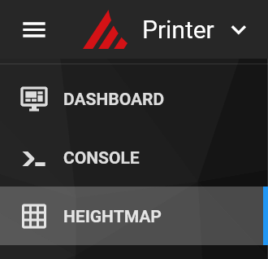
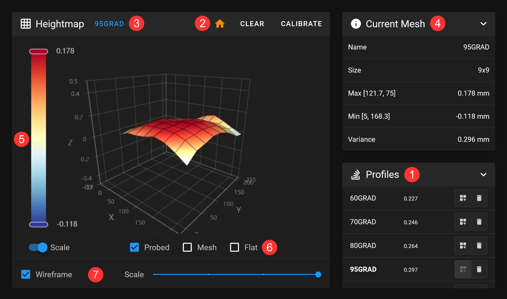

# Bed Mesh

Access and manage bed meshes to diagnose and resolve print bed issues.

To open the Bed Mesh interface, click on **HEIGHTMAP** in the navigation bar.

!!! information "Klipper Config"
    This option will only appear after Bed Mesh has been properly configured in Klipper. For setup instructions and additional details, refer to thea [Klipper documentation](https://www.klipper3d.org/Bed_Mesh.html){:target="_blank"}

1. This panel lists your Bed Mesh profiles. Klipper allows you to create multiple profiles, which you can select or delete here. Next to each profile name, you'll see the variance — the difference between the highest and lowest measurement points.

2. Create new profiles by performing a calibration using the `CALIBRATE` button in the title bar. From there, you can also home your printer and clear the currently loaded mesh. Don’t forget to save your changes—after calibration, a `Save Config` button will appear in the header.

3. Click on the profile name to rename the currently loaded mesh.

4. The `Current Mesh` panel displays key details of the loaded mesh, including its name, size, min and max values, as well as the variance.

5. You can adjust the scale by moving the sliders up or down. Additionally, use the toggle switch to restrict the scale to the profile’s minimum and maximum values.

6. You can display the probed mesh, the computed mesh, or a flat plane at Z=0.

7. Use the slider at the bottom to scale the mesh, making height differences easier to see. There’s also a switch to toggle the wireframe view.