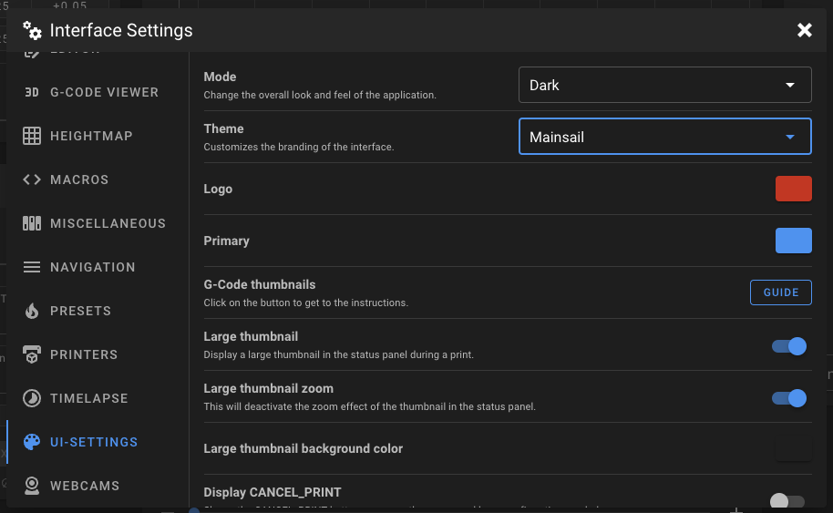

# Built-in Themes

Built-in themes are pre-designed themes that provide a quick and easy way to customize the look
and feel of Mainsail without creating a design from scratch.

Mainsail includes themes from two groups:

- **Open-Source Communities**: Themes from large open-source 3D printing projects
- **Vendor Sponsors**: Exclusive themes as recognition for their support

!!! tip "Want a Built-in Theme?"
    If you are a maintainer of a large open-source 3D printing project, contact the Mainsail
    crew on [Discord](https://discord.gg/mainsail){:target="_blank"} to request a built-in theme.

## Change Theme

To change the theme in Mainsail:

1. Open the **Interface Settings** by clicking the **cogs icon** in the top-right corner
2. Navigate to **UI-Settings**
3. Select a theme from the dropdown

<figure markdown="span">
  
  <figcaption>Interface Settings - UI-Settings</figcaption>
</figure>

## Available Themes

The following themes are currently available in Mainsail:

| Theme | Type |
|-------|------|
| Mainsail | Default |
| Klipper | Open-Source |
| Voron Design | Open-Source |
| VzBot | Open-Source |
| BigTreeTech | Sponsor |
| LDO Motion | Sponsor |
| Multec GmbH | Sponsor |
| Prusa Research | Sponsor |
| YUMI | Sponsor |

## Theme Options

Built-in themes can customize the following elements:

- **Sidebar Logo**: Custom logo (colorizable in UI-Settings)
- **Primary Color**: Accent color throughout the interface
- **Sidebar Background**: Background color or image for the sidebar
- **Main Background**: Background color or image for the main area
- **Custom CSS**: Additional styling

!!! note
    Most themes only change the sidebar logo, favicon, and primary color.
