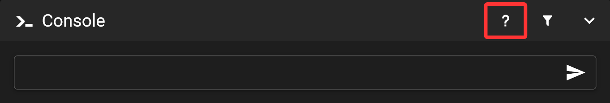
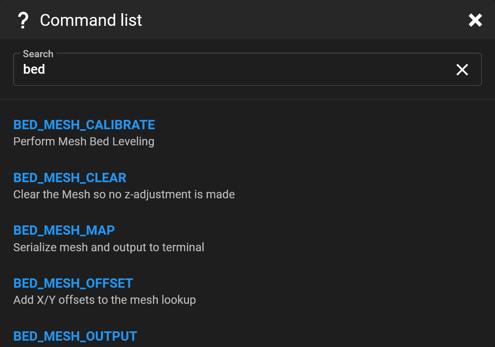
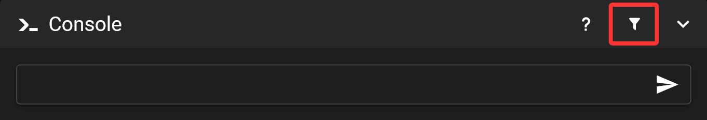

# Console

Send commands to your printer. Mainsail's console is available on the dashboard and as a separate page in the sidebar.

## Send commands

Start typing your command in the console input field. To submit, press Enter or click the paper airplane icon.

Use the `TAB` key to auto-complete commands. If multiple options are available, a list will appear—click on a command to select it, or continue typing and press `TAB` again to refine the suggestion.

## Find commands

Click the `?` icon in the title bar to view a list of available commands along with their descriptions.

You can filter this list using the search field.

## Filter console output

Click the funnel icon to select filters and suppress specific entries from the console output.

Mainsail includes a predefined filter for temperature status messages by default. You can also create additional custom filters in the **Settings**.
