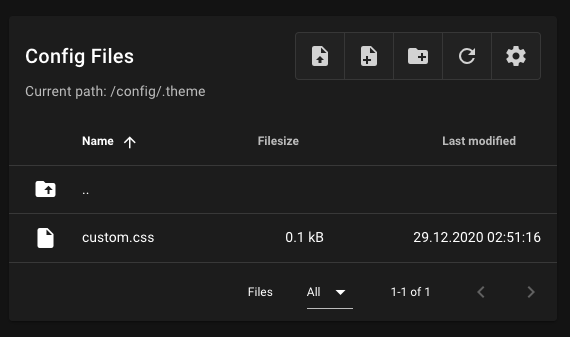
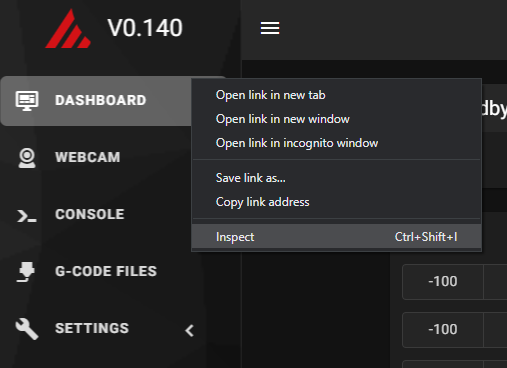
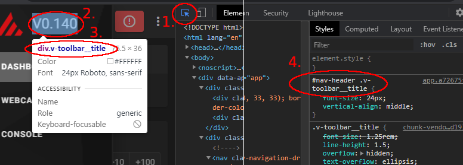
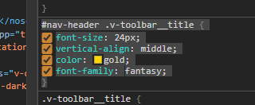
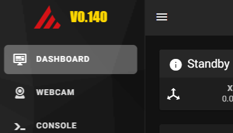

# Custom CSS

The `custom.css` file allows you to customize Mainsail's appearance without rebuilding the
application. Place a file named `custom.css` in your `.theme` folder to apply custom styles.



## Finding Elements to Customize

Use your browser's developer tools to inspect elements and find their CSS selectors.

!!! tip "Learning CSS"
    New to CSS? Learn the basics at
    [W3Schools CSS Tutorial](https://www.w3schools.com/css/){:target="_blank"}.

### Step 1: Open Developer Tools

Open the developer tools by pressing `F12` or right-clicking on the page and selecting
**Inspect**.



### Step 2: Select an Element

Click the element selector icon (or press `Ctrl+Shift+C`) and click on the element you
want to customize.



### Step 3: Find the Selector

In the Elements panel, find the CSS selector for the element. Look for class names or
IDs that identify the element.


### Step 4: Experiment with Styles

Use the Styles panel to experiment with different CSS properties. Changes are applied
live, so you can see the result immediately.



## Applying Your Styles

Once you have found the styles you want, copy the CSS rules to your `custom.css` file.

### Example

The following example changes the title color and font in the navigation header:

```css
#nav-header .v-toolbar__title {
    color: gold;
    font-family: fantasy;
}
```

After saving and reloading, the changes are applied:



!!! note "Browser Cache"
    After saving your changes, you may need to clear your browser cache. Press
    `Ctrl+Shift+F5` on Windows/Linux or `Cmd+Shift+R` on macOS.
