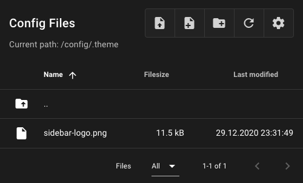
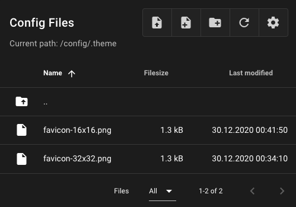

# Logos and Icons

Replace the default Mainsail logo and browser favicons with your own. Customizing these
elements helps identify your printers, especially when managing multiple machines.

Upload your files to the `.theme` folder using the file manager on the **Machine** page.

## Sidebar Logo

To replace the sidebar logo, place an image named `sidebar-logo` in your `.theme` folder.

| Property | Value |
|----------|-------|
| Filename | `sidebar-logo` |
| Valid extensions | `.svg`, `.jpg`, `.png`, `.gif` |

!!! tip "Dynamic SVG Colors"
    If you use an SVG file, you can use `var(--color-logo, #000000)` as the fill color.
    This allows the logo to automatically use the logo color from the **Interface Settings**.

## Favicons

To replace the browser favicon, place PNG images named `favicon-32x32.png` (required) and
optionally `favicon-16x16.png` in your `.theme` folder.

| Property         | Value                          |
|------------------|--------------------------------|
| Filename         | `favicon-32x32.png` (required) |
|                  | `favicon-16x16.png` (optional) |
| Valid extensions | `.png`                         |
| Recommended size | 32x32 px, 16x16 px             |

!!! note "Browser Cache"
    After uploading new favicons, you may need to clear your browser cache to see the
    changes. Press `Ctrl+Shift+F5` on Windows/Linux or `Cmd+Shift+R` on macOS.
