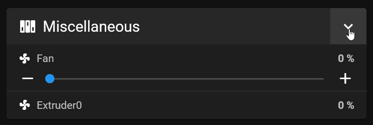

# Dashboard Organisation

Mainsail's dashboard is fully customizable to match your workflow. Rearrange panels, collapse sections to save
space, and create custom macro groups—all with separate layouts for desktop and mobile devices.

## Rearrange panels and show/hide them

The panels on the dashboard can be rearranged. How to do this is described in the
[Dashboard Settings page](../settings/dashboard.md).

Please note that settings can be customized for each device class, such as desktop or mobile. Each class supports
different column layouts, allowing you to display, hide, or reorder panels independently—for example, showing certain
panels on desktop while hiding them on mobile.

## Collapsible panels

Dashboard panels can be collapsed to temporarily save space and expanded again when needed. Mainsail will remember
your last layout, restoring it automatically on your next visit.

## Macro Management

The dashboard layout can be further customized through Mainsail's macro management system. In **Expert Mode**, you
can create macro groups that appear as separate panels on the dashboard. You can fully customize the macro colors
and control their visibility based on the printer's current status.

You can find more information at [Macro Management](macro-management.md)
