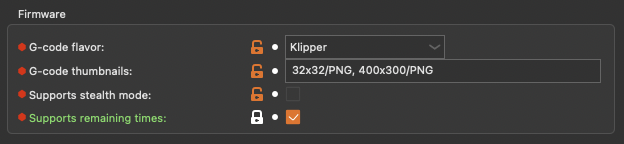
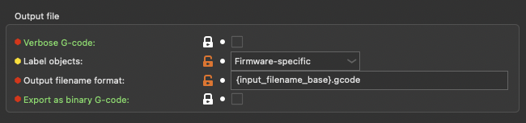
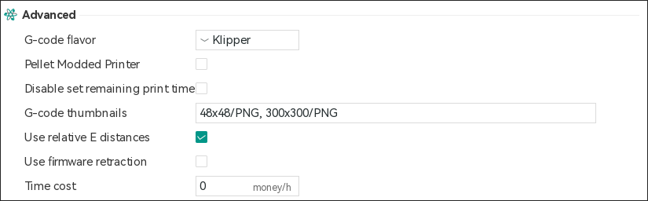
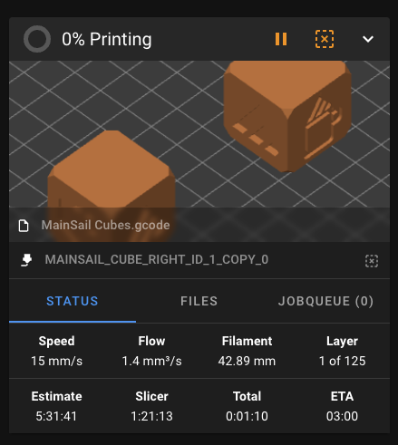

# Exclude Objects

You can exclude individual objects from an active print, allowing you to skip printing specific parts without stopping the entire job.

!!! information 
    This feature was integrated in Klipper v0.10.0-438, Moonraker v0.7.1-445 and Mainsail v2.1.0. Please check your installed versions first and update them if necessary.

To use this feature, your slicer must be set up to assign names to each object in the G-code. The G-code then needs to be preprocessed—either with a post-processing script in your slicer or by Moonraker. Additionally, this feature must be enabled in Klipper.

Since PrusaSlicer v2.7.0, the slicer can generate fully compatible G-code without needing Moonraker preprocessing.

!!! warning This feature only works with properly prepared G-code files. It will not function with older or unprocessed files.

## PrusaSlicer v2.7.0 and newer

First, verify the G-code flavor setting in:
`Printer Settings > General > Firmware > G-code flavor`



Next, you need to change the `Label Objects` setting to `Firmware-specific` in:
`Print Settings > Output options > Output file > Label objects`



## OrcaSlicer
Verify the G-code flavor setting in:
`Printer Settings > Basic Information > Advanced - G-code favlor`



## Enable exclude_object module in Klipper

Open your `printer.cfg` in Mainsail and add the following setting:

```
[exclude_object]
```

!!! information 
    For more information about the exclude_object module in Klipper see: [exclude_object](https://www.klipper3d.org/Exclude_Object.html){:target="_blank"}

## Using the Feature

From now on, all newly uploaded G-Code files will support this function. A new button, depicted as a dashed square with an “X”, will appear in the status panel to enable object exclusion.



Clicking the button opens a dialog where you can select individual objects to exclude from the current print job.


!!! warning
    Only G-Code files prepared in this way support excluding objects.