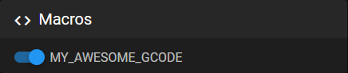

# Hide macros, outputs or fans

You can show and hide G-Code macros in the interface settings. Did you know that you can also hide G-Code macros by prefixing the name with an underscore?

You can control the visibility of G-Code macros directly from the **Interface Settings**. Alternatively, to hide a macro, simply prefix its name with an underscore (`_`).

```yaml
[gcode_macro MY_AWESOME_GCODE]
gcode:
    _MY_HELPER_CODE

[gcode_macro _MY_HELPER_CODE]
gcode:
    M300
```

`MY_AWESOME_GCODE` appears in your interface, `_MY_HELPER_CODE` does not.



!!! information
    This also works for other configuration sections including fans and outputs.

## `rename_existing` Macros

All `gcode_macros` that include the `rename_existing` attribute are automatically hidden in Mainsail. This is because they override default Klipper G-codes, which are already integrated into Mainsail through built-in interface buttons.

For example, the `PAUSE` macro in the `mainsail.cfg`:

```yaml
[gcode_macro PAUSE]
description: Pause the actual running print
rename_existing: PAUSE_BASE
gcode:
    PAUSE_BASE
    _TOOLHEAD_PARK_PAUSE_CANCEL
```