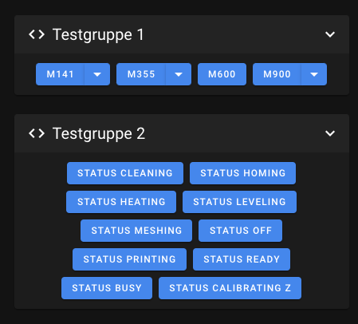

# Macro Management

Mainsail provides powerful tools to organize your G-Code macros. You can create groups, assign
colors, change the display order, and automatically show or hide macros based on specific
printer states like printing, paused, or idle.

## Features

- **Groups**: Organize macros into collapsible groups for a cleaner interface
- **Colors**: Assign colors to macros for quick visual identification
- **Sorting**: Change the display order of macros within groups
- **State-based visibility**: Automatically show or hide macros based on printer state
  (idle, printing, paused)

## Macro Groups

You can organize your macros into groups to keep related macros together and reduce clutter
in the interface.

For detailed configuration options, see the [Macros Settings](../settings/macros.md) page.
