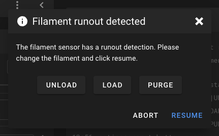
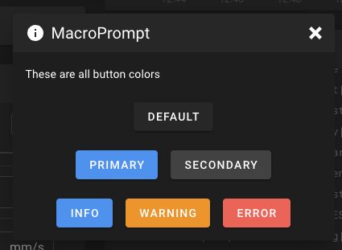
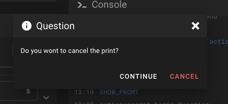

# Macro Prompts

Macro Prompts allow Klipper macros to trigger interactive dialog prompts in Mainsail. Users can
choose different options, making it possible to create guided workflows, confirmation dialogs,
or custom control interfaces.



!!! warning "Requirements"
    - Macro prompts require the `[respond]` module in your Klipper config
    - This feature requires Mainsail v2.9.0 or newer

## Supported Commands

You can create custom macro prompts using the following commands:

### Begin Prompt

```
// action:prompt_begin <headline>
```

This command starts the definition of a prompt. The `<headline>` sets the title displayed at the
top of the prompt dialog.

### Add Text

```
// action:prompt_text <text>
```

Adds a descriptive text to the prompt.

### Add Button

```
// action:prompt_button <label>|<gcode?>|<color?>
```

Adds a button to the prompt dialog.

- **`<label>`**: The text displayed on the button.
- **`<gcode?>`** *(optional)*: G-code to execute when the button is pressed. Defaults to the
  label text if not specified.
- **`<color?>`** *(optional)*: Sets the button color. Possible values are `primary`, `secondary`,
  `info`, `warning`, `error` (default is dark gray).



### Start Button Group

```
// action:prompt_button_group_start
```

Begins a button group, allowing multiple buttons to be displayed in the same row within the
prompt dialog.

### End Button Group

```
// action:prompt_button_group_end
```

Closes the current button group.

### Add Footer Button

```
// action:prompt_footer_button <label>|<gcode?>|<color?>
```

Adds a button to the footer of the prompt dialog.

- **`<label>`**: The text displayed on the button.
- **`<gcode?>`** *(optional)*: G-code to execute when the button is pressed. Defaults to the
  label text if not specified.
- **`<color?>`** *(optional)*: Sets the button color. Possible values are `primary`, `secondary`,
  `info`, `warning`, and `error` (default is white).



### Show Prompt

```
// action:prompt_show
```

Displays the prompt dialog. This command finalizes the prompt setup and makes it visible to the
user.

### Close Prompt

```
// action:prompt_end
```

Closes or hides the prompt dialog.

## Examples

Here are some examples of macro prompts:

### Prompt with Multiple Button Groups

```ini
[gcode_macro SHOW_PROMPT_BUTTON_GROUPS]
gcode:
    RESPOND TYPE=command MSG="action:prompt_begin MacroPrompt"
    RESPOND TYPE=command MSG="action:prompt_text These are all button colors"
    RESPOND TYPE=command MSG="action:prompt_button default|TEST"
    RESPOND TYPE=command MSG="action:prompt_button_group_start"
    RESPOND TYPE=command MSG="action:prompt_button primary|TEST|primary"
    RESPOND TYPE=command MSG="action:prompt_button secondary|TEST|secondary"
    RESPOND TYPE=command MSG="action:prompt_button_group_end"
    RESPOND TYPE=command MSG="action:prompt_button_group_start"
    RESPOND TYPE=command MSG="action:prompt_button info|TEST|info"
    RESPOND TYPE=command MSG="action:prompt_button warning|TEST|warning"
    RESPOND TYPE=command MSG="action:prompt_button error|TEST|error"
    RESPOND TYPE=command MSG="action:prompt_button_group_end"
    RESPOND TYPE=command MSG="action:prompt_show"
```

### Simple Question Prompt

```ini
[gcode_macro SHOW_PROMPT]
gcode:
    RESPOND TYPE=command MSG="action:prompt_begin Question"
    RESPOND TYPE=command MSG="action:prompt_text Do you want to cancel the print?"
    RESPOND TYPE=command MSG="action:prompt_footer_button continue|RESPOND TYPE=command MSG=action:prompt_end"
    RESPOND TYPE=command MSG="action:prompt_footer_button CANCEL|CANCEL_PRINT|error"
    RESPOND TYPE=command MSG="action:prompt_show"
```

!!! tip
    You can close any prompt programmatically by calling `action:prompt_end` from another
    macro or button.
