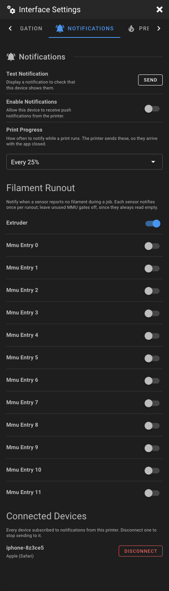

# Push Notifications

Mainsail can subscribe your device to Web Push, so the printer notifies you when a job finishes,
fails or runs out of filament — even with the app closed. Notifications are delivered by the
browser's own push service, so your phone does not need to reach the printer to receive one.

!!! information "Requirements"
    The **page** must be served from an HTTPS origin, because browsers expose no service worker
    and no Push API over plain HTTP. The printer itself does not need a certificate: the remote
    access services on the [Remote Access](../faq/remote-access.md) page terminate TLS for you and
    serve Mainsail from their own HTTPS origin.

    This was verified against a printer serving only plain HTTP on port 80, using
    [OctoEverywhere](https://octoeverywhere.com/) — no certificate, no nginx change, no domain and
    no port forwarding. [Obico](https://www.obico.io/), Cloudflare Tunnel and
    [Tailscale](https://tailscale.com/kb/1242/tailscale-serve) work the same way. `localhost` also
    counts as secure during development.

!!! warning "iOS"
    On iOS the Push API only exists once the web app has been **added to the home screen**. Open
    Mainsail in Safari, share → *Add to Home Screen*, then open it from the home screen icon. The
    Notifications tab tells you if this step is still missing.

## Getting an HTTPS origin

If you reach Mainsail at a LAN address such as `http://printer.local`, the Notifications
section will tell you a secure connection is required. The printer does not need a certificate
of its own — it is enough to reach Mainsail through something that terminates TLS for it.

[OctoEverywhere](https://octoeverywhere.com/) is the shortest path, and is free. On the
printer:

```bash
git clone https://github.com/QuinnDamerell/OctoPrint-OctoEverywhere
cd OctoPrint-OctoEverywhere
./install.sh
```

The installer finds the frontend by itself — confirm when it offers *Mainsail on port 80* —
and then prints a code. Enter that at [octoeverywhere.com/code](https://octoeverywhere.com/code)
to link the printer to a free account.

Nothing on the printer changes: it keeps serving plain HTTP, nginx is untouched, no certificate
is installed and no port is forwarded. You simply gain a second address of the form
`https://<printer-name>.octoeverywhere.com`, which is a secure origin.

!!! warning "Install the web app from the HTTPS address"
    A push subscription belongs to the origin that created it. Add **that** address to your
    home screen and enable notifications there. The LAN address is a different origin, cannot
    subscribe over plain HTTP, and will never receive anything.

[Obico](https://www.obico.io/), Cloudflare Tunnel and
[Tailscale](https://tailscale.com/kb/1242/tailscale-serve) provide an HTTPS origin the same
way, if you would rather self-host or already use one of them.

## Subscribe your device

Do this from the **installed** web app, not a browser tab — subscribing binds the notifications to
the app that will display them, so **Test Notification** and **Enable Notifications** are shown
there only. The rest of the section, including the device list below, appears anywhere.

1. Open the **Interface Settings** by clicking the **cogs icon** in the top-right corner.
2. Switch to the **Notifications** section.
3. Turn on **Enable Notifications** and accept the browser's permission prompt.



On the first device, Mainsail generates the VAPID key pair in the browser and writes the private
half to `webpush/vapid_private.pem` in the config directory. There is no key to generate by hand
and nothing to paste.

!!! warning "Both halves live in the config directory"
    `vapid_private.pem` and `subscriptions.json` sit in the config root, as that is the only place
    Mainsail can write through Moonraker. Anything there is readable by whoever can reach the
    interface, and the two files together are enough for someone to send a notification to your
    devices. They grant no access to the printer itself. Worth knowing if your Moonraker is
    reachable by people you do not trust.

Your device is written to `webpush/subscriptions.json` in the config directory, merged with any
devices already listed. Each entry is the `endpoint` and `keys` pair the browser produced, which is
all a push sender needs.

Use **Send** next to **Test Notification** to confirm your device displays notifications. That one
is produced locally by the browser, so it works before the printer side is set up.

A device can be removed again from **Connected Devices** at the bottom of the section, which lists
every subscription the printer holds. That list is shown on any device, so a phone that was reset
or reinstalled can be dropped from a desktop.

## Send notifications from Moonraker

Moonraker's `[notifier]` sends through Apprise, which speaks Web Push with the `vapid://` scheme.
**You do not write this section.** Mainsail adds it to `moonraker.conf` the first time a device
subscribes, lists every connected device as a target, rewrites it whenever a device is added or
removed, deletes it when the last device disconnects, and restarts Moonraker each time. This is
what it writes:

```ini
[notifier webpush]
url: vapid://webpush@example.com/<device>/<device>?keyfile=/home/pi/printer_data/config/webpush/vapid_private.pem&subfile=/home/pi/printer_data/config/webpush/subscriptions.json
events: complete, error, cancelled
body: {event_message}Print {event_name}
    {event_args[1].filename}
```

Each `<device>` is a key in `subscriptions.json`; Apprise lowercases these names. The
`webpush@example.com` address is only the contact claim the push services require of a VAPID
sender, and is never mailed.

!!! information "Mainsail owns this section"
    It is rewritten from the subscription file whenever the Notifications settings are opened, so
    an edit by hand does not survive. Everything else in `moonraker.conf` is left byte for byte as
    it was.

!!! information "Why the body template has two branches"
    Job events fill `event_args`, while a message sent through the `notify` remote method arrives
    in `event_message` with `event_args` empty. A template using only `event_args` raises an error
    on the second kind.

Apprise folds the title into the body and sends plain text, so the service worker treats the first
line of a message as the notification title and the rest as its body.

## Progress and runout notifications

Two further settings appear in the **Notifications** section once their Klipper macros are loaded:

- **Print Progress** — notify every 10%, 25%, 50%, or only when the job ends.
- **Filament Runout** — one switch per filament sensor, each notifying once per runout.

Mainsail installs those macros itself. The first time you open the Notifications settings it
writes `webpush/notify.cfg` into your config directory, adds `[include webpush/notify.cfg]` to
`printer.cfg`, and restarts Klipper — straight away if the printer is idle, otherwise once the
current print finishes. There is nothing to add by hand.

Both are driven from the printer rather than the browser, so they fire with no browser open, and
both are shown wherever you open the settings — unlike the subscribe controls above, they are not
properties of the device you happen to be looking at. Changing either takes effect immediately and
needs no restart.

For reference, this is the file Mainsail writes:

```ini
# Push notifications for Mainsail's installed web app (PWA).
#
# Include this from printer.cfg. Mainsail's Notifications settings drive the
# two variables in [gcode_macro _NOTIFY_SETTINGS] with SET_GCODE_VARIABLE, so
# a change applies at once; edit the defaults here to change what a fresh
# restart falls back to.
#
# Delivery is Moonraker's [notifier webpush] and the "notify" remote method
# it registers, so notifications reach every subscribed browser with no
# browser open on the printer.

[gcode_macro NOTIFY]
description: Send a custom push notification to every subscribed device
gcode:
    
        {action_raise_error("Must provide MESSAGE parameter")}
    
    # Apprise folds the title into the body, and the service worker treats the
    # first line as the title -- so send "title<newline>body" when TITLE is given.
    
    {action_call_remote_method("notify", name="webpush", message=body)}


# Settings. Mainsail writes them here and also applies them live with
# SET_GCODE_VARIABLE, so a change needs no restart and survives one.

[gcode_macro _NOTIFY_SETTINGS]
variable_progress_interval: 25
variable_runout_sensors: "extruder"
gcode:
    # holds settings only, never called directly


# Progress notifications. 100 means "completion only", which the
# [notifier webpush] complete event already covers.

[gcode_macro _NOTIFY_PROGRESS_VARS]
variable_last_step: -1
gcode:
    # holds latch state only, never called directly

[delayed_gcode NOTIFY_PROGRESS_CHECK]
initial_duration: 30
gcode:
    
    
    

    
        
        
        # 100% is deliberately left to the print-complete notification
        
            SET_GCODE_VARIABLE MACRO=_NOTIFY_PROGRESS_VARS VARIABLE=last_step VALUE={step}
            NOTIFY TITLE="Print {step}%" MESSAGE="{printer.print_stats.filename}"
        
    
        # reset once the job ends, ready for the next print
        SET_GCODE_VARIABLE MACRO=_NOTIFY_PROGRESS_VARS VARIABLE=last_step VALUE=-1
    

    UPDATE_DELAYED_GCODE ID=NOTIFY_PROGRESS_CHECK DURATION=30


# Filament runout. A runout is a present-to-absent transition while a print is
# active, not a static empty reading: when a job starts, every watched sensor
# that is already empty is latched silently, so an MMU's idle gates never fire.
# Each sensor is latched separately and unlatches once filament is seen again,
# so it notifies once per runout and again on a second runout. The watched list
# is a plain comma-separated string.

[gcode_macro _NOTIFY_RUNOUT_VARS]
variable_latched: {}
variable_active: 0
gcode:
    # holds per-sensor latch state and the last-seen print-active flag only,
    # never called directly

[delayed_gcode NOTIFY_RUNOUT_CHECK]
initial_duration: 35
gcode:
    
    
    
    
    
    
    # first tick of a new job: seed the latch from what is already empty
    
    
    

    
        
            
            
            
            

            
                
                    NOTIFY TITLE="Filament runout" MESSAGE="{name} reports no filament"
                
                
            
        
    

    # a sensor that reads filament again drops out of the latch, so a second
    # runout fires again; once the job ends the latch empties for the next one
    
        SET_GCODE_VARIABLE MACRO=_NOTIFY_RUNOUT_VARS VARIABLE=latched VALUE="{ns.next}"
    
    
        SET_GCODE_VARIABLE MACRO=_NOTIFY_RUNOUT_VARS VARIABLE=active VALUE={active_flag}
    

    UPDATE_DELAYED_GCODE ID=NOTIFY_RUNOUT_CHECK DURATION=15
```

The chosen interval and sensor list live inside that file as macro variables, so nothing else in
your config is needed.

!!! information "Multi-material printers"
    An MMU reports every **unused** gate as empty. That is harmless: a sensor already empty when a
    print starts is recorded as such and never notifies for that print. Only a sensor that **loses**
    filament while printing does. So you can switch on every gate you load; the toolhead sensor is
    on by default simply because every printer has one.

    The check runs every 15 seconds, so a runout in the first few seconds of a job is recorded as
    "already empty" and not pushed. Klipper's own `runout_gcode` still pauses the print as usual —
    only the phone notification is skipped.

## Send your own notifications

With the `NOTIFY` macro installed, any G-code can raise a notification, including from your slicer's
start or end G-code:

```gcode
NOTIFY TITLE="Bed levelled" MESSAGE="Starting the first layer"
```

## Troubleshooting

| Symptom | Cause |
| --- | --- |
| "Push notifications require a secure connection" | Mainsail is being served over HTTP. Reach it through one of the HTTPS options under [Remote Access](../faq/remote-access.md). |
| "Add Mainsail to your home screen…" | iOS only exposes push to an installed web app. |
| The test notification works but the printer never notifies | Your device is not in `subscriptions.json`, or the `<device>` name in the notifier URL does not match its key. |
| Progress or runout settings are missing | Klipper has not restarted since Mainsail installed the macros. It restarts automatically when the printer is idle; if a print was running, wait for it to finish. |
| **Test Notification** and **Enable Notifications** are missing | They are shown only in the installed web app, since a plain browser tab is not what receives the notifications. |
| Mainsail says another copy of the macros is installed | These macros are already reaching Klipper from another file. Remove that `[include]` so Mainsail can manage them, or leave it and manage them yourself. |
