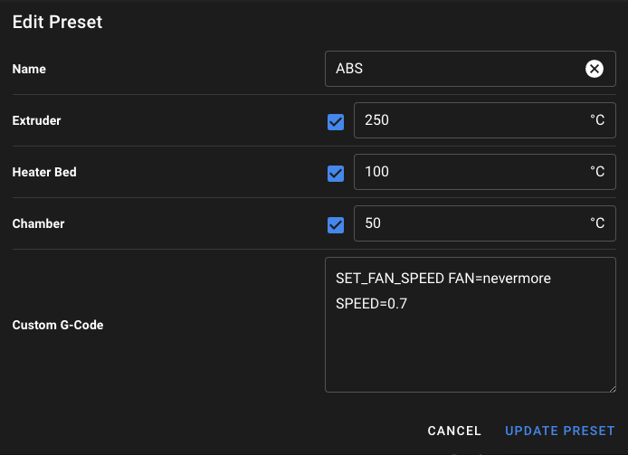
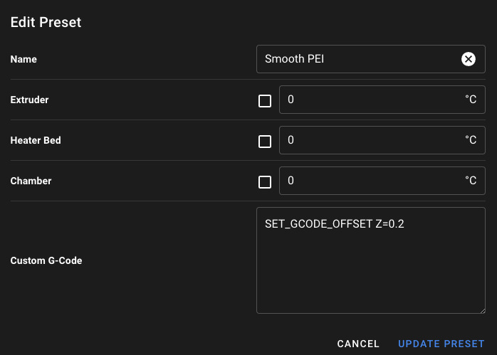

# Presets

Mainsail supports **presets**, which can be used for preheating, cooling down, and executing G-Code commands.

## Setup

Open Mainsail’s **Settings** and navigate to the **Preheat Presets** section. Here, you can create custom presets by clicking **ADD PRESET**.

## Preheat

Enter a name for your preset—usually the filament type, color, or any other descriptive text. Then, set the desired temperatures. You can disable individual heaters if needed and provide custom G-code. After setting the selected temperatures, the G-Code will be executed.

## Further Examples

### Z-Offset

You can add custom G-Code to easily switch between different Z-offsets, making it more convenient to work with various surfaces.

To configure the G-Code, use the command `SET_GCODE_OFFSET Z=0.2`, replacing `0.2` with the Z-offset value you require.

