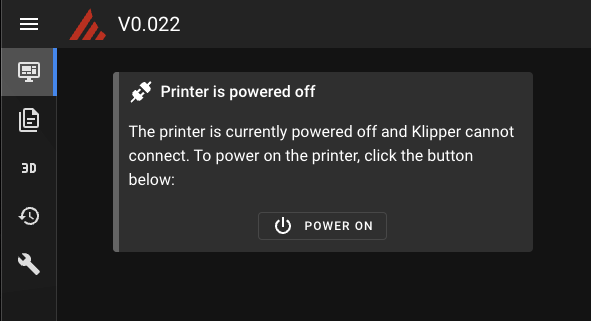

# Printer Power Device

Mainsail can integrate with Moonraker's power device feature to let you turn your printer on and
off directly from the web interface. When Klipper is not connected because the printer is powered
off, Mainsail displays a dedicated power panel instead of the usual Klipper error, allowing you to
power on the printer with a single click.

<figure markdown="span">

<figcaption>Printer is powered off panel</figcaption>
</figure>

## Moonraker Configuration

To enable this feature, you need to configure a power device in your `moonraker.conf` with the
name `printer` and the `bound_services` attribute set to `klipper`:

```ini title="moonraker.conf"
[power printer]
type: <any supported type>
bound_services: klipper
```

!!! important
    The device **must** be named `printer` and include `bound_services: klipper`. Mainsail uses
    this specific name to detect a powered-off printer and display the power panel.

## Supported Power Device Types

Moonraker supports various power device types. Choose the one that matches your hardware setup:

- `gpio` — Control a relay via a GPIO pin
- `tplink_smartplug` — TP-Link smart plugs
- `tasmota` — Tasmota-flashed smart plugs
- `shelly` — Shelly smart plugs and relays
- `homeseer` — HomeSeer smart plugs
- `homeassistant` — Home Assistant entities
- `loxonev1` — Loxone relays
- `uhubctl` — USB port power control
- And more — see the
  [Moonraker power documentation](https://moonraker.readthedocs.io/en/latest/configuration/#power){:target="_blank"}
  for a full list

## Example: GPIO Relay

```ini title="moonraker.conf"
[power printer]
type: gpio
pin: gpio26
off_when_shutdown: True
on_when_job_queued: True
locked_while_printing: True
restart_klipper_when_powered: True
restart_delay: 1
bound_services: klipper
```

## How It Works

1. When the printer is powered off, Klipper cannot connect to the MCU
2. Instead of showing a Klipper connection error, Mainsail detects the `printer` power device
3. A power panel is displayed with a button to turn on the printer
4. After powering on, Klipper automatically starts and connects to the MCU
