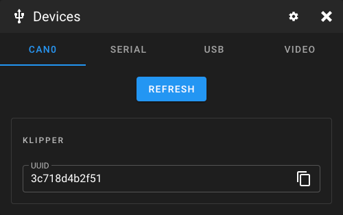
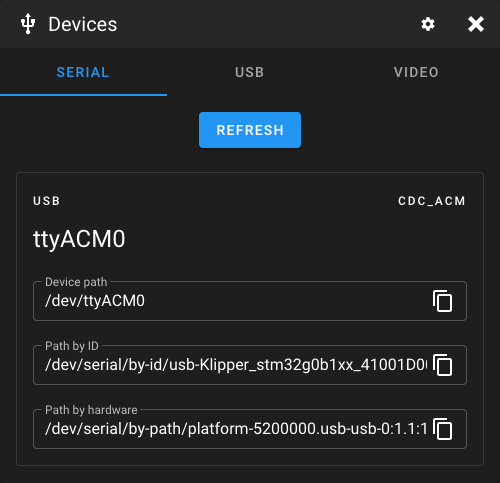
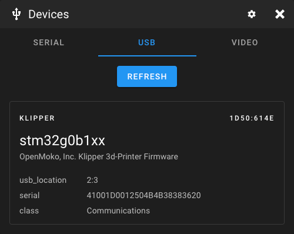
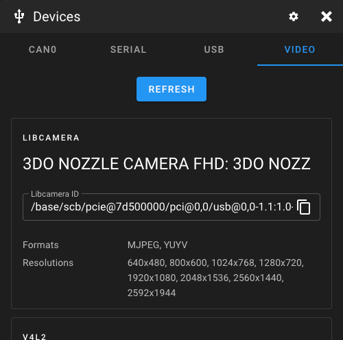

# Query Devices

Mainsail can list connected CAN, Serial, USB, and Video devices to help you find the correct
hardware paths for your configuration. This is useful when setting up your printer or webcam.

To access the device list, open any config file in the editor and click the **Devices** button
in the toolbar.

## CAN Devices

This tab displays unassigned CAN nodes on your network. Each entry shows the application type
(Klipper or Katapult) and the UUID.

<figure markdown="span">
  
  <figcaption>Find devices dialog with CAN devices</figcaption>
</figure>

!!! note "Unassigned Nodes"
    An "unassigned" node is a CAN device that has not been activated by Katapult or Klipper.
    Once Klipper or Katapult connects to a node, it receives a Node ID and will no longer
    respond to queries. A device reset is required to make it queryable again.

!!! warning "Multiple Unassigned Nodes"
    When multiple unassigned nodes are on the network, queries can cause arbitration errors.
    It is recommended to only query when a single unassigned node is on the network. If you
    need to query multiple nodes, reset all nodes before running Klipper.

For more details, see the
[Moonraker CAN documentation](https://moonraker.readthedocs.io/en/latest/web_api/#query-unassigned-canbus-uuids){:target="_blank"}.

## Serial Devices

This tab shows serial connections to your printer mainboard. Use these paths in your
`printer.cfg` for the `[mcu]` section:

<figure markdown="span">
  
  <figcaption>Find devices dialog with Serial devices</figcaption>
</figure>

```ini
[mcu]
serial: /dev/serial/by-id/usb-Klipper_...
```

## USB Devices

This tab is intended for debugging. It shows whether the system recognizes connected USB
devices, which can help troubleshoot connection issues.

<figure markdown="span">
  
  <figcaption>Find devices dialog with USB devices</figcaption>
</figure>

## Video Devices

This tab lists all libcamera and V4L2 webcams connected to your system. It also displays
available resolutions and video formats for each device, which is useful when configuring
webcams in Crowsnest or Mainsail.

<figure markdown="span">
  
  <figcaption>Find devices dialog with Video devices</figcaption>
</figure>
