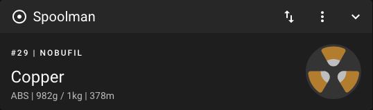
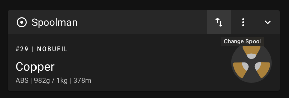
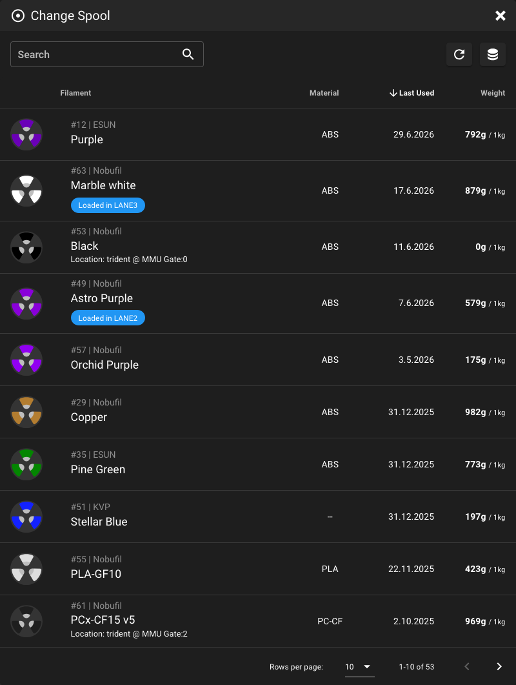
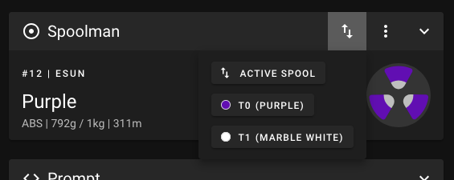

# Spool Management

Mainsail has full support for [Spoolman](https://github.com/Donkie/Spoolman), a
filament management system that keeps track of your spools, vendors, and
filament types. Once Spoolman is connected to Moonraker, it automatically
subtracts the used filament during each print and Mainsail shows the active
spool.

<figure markdown="span">

<figcaption>Spoolman panel in Mainsail</figcaption>
</figure>

## Features

- **Active Spool**: See the currently selected spool with material, remaining
  weight, and length
- **Spool Selection**: Switch the active spool directly from the dashboard panel
- **Automatic Tracking**: Moonraker reports the used filament back to Spoolman
  at the interval defined by `sync_rate`
- **Filament Data**: Vendor, material, and color are shown in Mainsail

## Setup Spoolman

Spoolman needs to be installed and configured in Moonraker. See the
[Spoolman documentation](https://github.com/Donkie/Spoolman). It can be
installed via a Docker container or directly on a Raspberry Pi or some other
Homelab server. You only have to install Spoolman once, also when you have
multiple printers.

## Add Spoolman to Moonraker

To add Spoolman to Moonraker, you need to add the following lines to your
`moonraker.conf` file:

```yaml
[spoolman]
server: http://192.168.0.123:7912
#   URL to the Spoolman instance. This parameter must be provided.
sync_rate: 5
#   The interval, in seconds, between sync requests with the
#   Spoolman server.  The default is 5.
```

To learn more about the configuration options, see the
[Moonraker documentation](https://moonraker.readthedocs.io/en/latest/configuration/#spoolman).

After Moonraker is connected to Spoolman, the **Spoolman** panel is available in
Mainsail. You can show, hide, or reorder it in the
[Interface Settings](../settings/dashboard.md).

## Change the Active Spool

To change the active spool, click the **Change Spool** button in the Spoolman
panel toolbar (the third button from right).

<figure markdown="span">

<figcaption>Change active spool button</figcaption>
</figure>

A dialog will open with a list of all spools in the Spoolman database. You can
use the search field to filter the list. Click on a row to select a spool.

<figure markdown="span">

<figcaption>Change spool dialog</figcaption>
</figure>

## Toolchanger support

For toolchange macros (T0, T1, T<n>) to appear in the "Change Spool" dropdown,
add a `spool_id` variable to your gcode_macro with a default value of None, and
call `SET_ACTIVE_SPOOL` in your toolchange macro:

```yaml
[gcode_macro T0]
variable_spool_id: None
gcode:
  ...
  SET_ACTIVE_SPOOL ID={ printer['gcode_macro T0'].spool_id }
  ...
```

<figure markdown="span">

<figcaption>Change spool dropdown</figcaption>
</figure>

### Remembering spools across restarts

If Mainsail detects a `[save_variables]` section in your configuration: 

```yaml
[save_variables]
filename: ~/printer_data/config/variables.cfg
```

It will automatically save the selected spool on each change. Use this macro to
restore the selection after a restart:

```yaml
[delayed_gcode RESTORE_SELECTED_SPOOLS]
initial_duration: 0.1
gcode:
  
  
    
      
      
      
        SET_GCODE_VARIABLE MACRO={macro} VARIABLE=spool_id VALUE={svv[var]}
      
    
  
```
