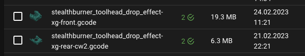

# Thumbnails

Mainsail can display thumbnails in the file browser and as previews in the print status. These
thumbnails are generated by your slicer and embedded in the G-code file.

<figure markdown="span">
  
  <figcaption>Thumbnail in print start dialog</figcaption>
</figure>

<figure markdown="span">
  
  <figcaption>Thumbnails in G-code files list</figcaption>
</figure>

## Slicer Configuration

To display thumbnails in Mainsail, your slicer must be configured to generate and embed them
in the G-code file.

For detailed setup instructions, see the [Slicer Configuration](/slicer/) section.

!!! tip "Recommended Thumbnail Sizes"
    For best results, configure your slicer to generate thumbnails at 32x32 and 400x300
    pixels. The small size is used in the file list, while the large size is displayed in
    the print start dialog.
