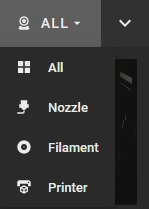

# Webcams

Mainsail supports one or more webcam streams, allowing you to monitor your printer from
anywhere. Webcams can be displayed in various locations throughout the interface.

Webcam streams can be displayed in the following places:

- **Dashboard**: The webcam panel appears on the dashboard and can be moved, collapsed, or
  hidden. See [Dashboard Organisation](/features/dashboard-organisation/) for details.
- **Webcam Page**: A dedicated webcam page can be added to the navigation sidebar. Enable
  this in **Interface Settings** > [UI-Settings](/settings/ui-settings/).
- **Print Farm Overview**: When using multiple printers, webcam streams are displayed in the
  print farm overview for quick monitoring of all machines.

## Multiple Webcams

When more than one webcam is configured, all cameras are displayed in an overview. You can
switch to a single camera using the dropdown menu in the panel header.

<figure markdown="span">
  
  <figcaption>Dropdown menu for switching between webcams</figcaption>
</figure>

## Configuration

To learn how to set up webcams and configure streaming options, see the
[Webcams Settings](/settings/webcams/) page.

For webcam streaming software setup, refer to the
[Crowsnest documentation](https://crowsnest.mainsail.xyz){:target="_blank"}.
