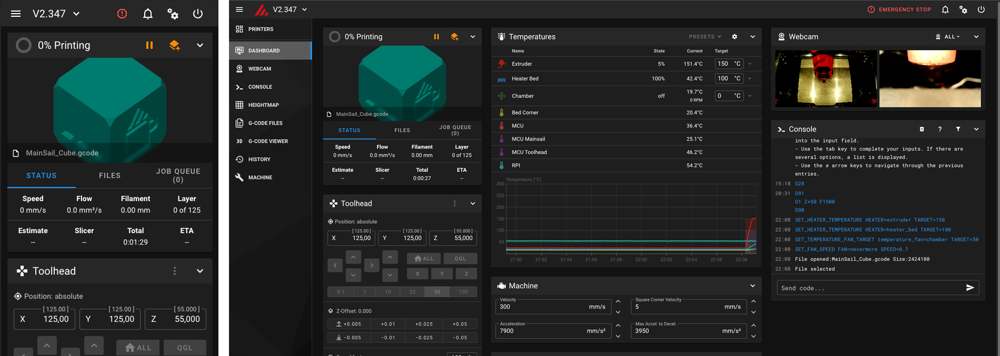
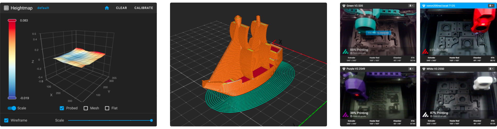

# Welcome to Mainsail

Mainsail is a powerful and user-friendly web interface for managing and controlling 3D printers powered by Klipper
firmware. Its sleek, intuitive dashboard makes it easy to start prints, monitor progress, and fine-tune settings - all
in real time. With features like live print monitoring, detailed statistics, macro management, and a highly customizable
layout, Mainsail helps you get the most out of your printers. Backed by an active community and comprehensive
documentation, you have all the support you need to optimize your 3D printing workflow.

## Screenshots

<figure markdown="span">

<figcaption>Screenshot Dashboard (Mobile & Desktop)</figcaption>
</figure>

<figure markdown="span">

<figcaption>Heightmap, G-code viewer, Farm mode</figcaption>
</figure>

## Key Features

- **Klipper-native Control:** Manage your printer in real time through a fast, responsive Moonraker-based interface.
- **Multi-Printer Management:** Control and monitor multiple printers from one interface.
- **Live Print Monitoring:** Track temperatures, progress, and printer state at a glance.
- **Macro Workflows:** Run, organize, and customize macros with prompts and parameter support.
- **Integrated File Management:** Upload, organize, and edit G-Code and configuration files directly in your browser.
- **Print Insights:** Review print history and usage statistics to optimize reliability and performance.
- **3D Visualization Tools:** Use Bed Mesh and G-Code Viewer for better first-layer and print diagnostics.
- **Flexible Dashboard:** Arrange dashboard cards and navigation to match your workflow.
- **Theme Customization:** Personalize Mainsail with built-in themes, logos, backgrounds, and custom CSS.
- **Webcam and Timelapse Support:** Monitor prints from multiple camera angles and create automated timelapses with
[moonraker-timelapse](https://github.com/mainsail-crew/moonraker-timelapse).
- **Power Device Integration:** Control relays and supported smart power devices directly in Mainsail.
- **Slicer Integration:** Send print jobs from supported slicers to streamline your print workflow.
- **Multilingual Support:** Use Mainsail in your preferred language with built-in localization.
- **Temperature Presets:** Save and apply preheat profiles for faster print preparation.
- **Object Exclusion:** Exclude individual objects during a print to salvage the remaining parts.

## Vendor Partners

These vendors support us financially in developing Mainsail. If you are also a vendor and use Mainsail on the
3D printers you sell, we would be happy if you also support us via
[Patreon](https://www.patreon.com/meteyou){:target="_blank"} or [GitHub](https://github.com/sponsors/mainsail-crew).

[{.sponsor-logo-large}](https://www.bigtreetech.com/){:target="_blank"}

[BIGTREETECH](https://www.bigtreetech.com/){:target="_blank"} is the **official mainboard partner** of Mainsail.
BIGTREETECH is committed to developing innovative and competitive products to serve the 3D printing community better.
Follow them on [Facebook](https://www.facebook.com/BIGTREETECH){:target="_blank"} or
[Twitter](https://twitter.com/BigTreeTech){:target="_blank"}.

  

  [{.sponsor-logo}](https://ldomotors.com/){:target="_blank"}
  **LDO Motors**
  

  

  [{.sponsor-logo}](https://www.prusa3d.com/){:target="_blank"}
  **Prusa Research**
  

  

  [{.sponsor-logo}](https://www.wanhao.store/){:target="_blank"}
  **Wanhao / Yumi**
  

!!! heart "Support Mainsail"

    Mainsail is an open-source project maintained by [meteyou](https://github.com/meteyou) and a passionate community.
    Your support helps us continue to improve and expand the platform.

    [:fontawesome-solid-heart: Learn how you can support Mainsail](sponsors.md){ .md-button .md-button--primary }
