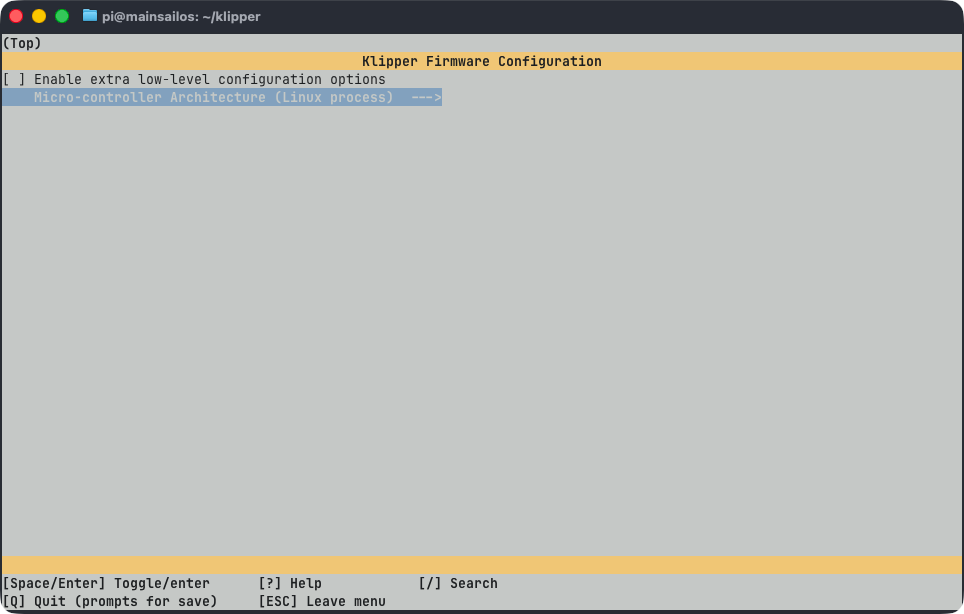

# Linux RPi MCU

Your single-board computer (SBC), such as a Raspberry Pi, can be used as a secondary MCU in Klipper. This allows you to
use the GPIOs and buses (I2C, SPI) of your SBC directly in your Klipper configuration. For example to control
additional fans, LEDs, or to read sensors without needing extra hardware.

## Install the Systemd Service

The `klipper-mcu` service must start before Klipper itself. To install and enable it, run:

```bash
cd ~/klipper/
sudo cp ./scripts/klipper-mcu.service /etc/systemd/system/
sudo systemctl enable klipper-mcu.service
```

## Build the Micro-Controller Code

Start by configuring the firmware for the Linux process. Run:

```bash
cd ~/klipper/
make clean
make menuconfig
```

<figure markdown="span">

<figcaption>make menuconfig</figcaption>
</figure>

In the menu, set **Microcontroller Architecture** to **Linux process**, then press `Q` to exit and press `Y` to save the
configuration.

## Flash the Micro-Controller

To build and install the firmware, run:

```bash
sudo systemctl stop klipper.service
make flash
sudo systemctl start klipper.service
```

!!! tip "Permission Denied Error"
    If `klippy.log` reports a "Permission denied" error when connecting to `/tmp/klipper_host_mcu`, add your user to
    the `tty` group:

    ```bash
    sudo usermod -a -G tty $USER
    ```

## Configure the MCU in printer.cfg

Add the following section to your `printer.cfg` to enable your SBC as a secondary MCU:

```ini
[mcu host]
serial: /tmp/klipper_host_mcu
```

After saving, restart Klipper. You can now reference the host MCU pins in your configuration using the `host:` prefix,
for example:

```ini title="Example 1: A led strip controlled by the GPIO20 on the RPi"
[output_pin caselight]
pin: host:gpio20
# You can also write the pin in extended form by specifying
# the reference gpiochip.
#pin: host:gpiochip0/gpio20
```

```ini title="Example 2: Using the i2c bus of the RPi to read a sensor"
[temperature_sensor enclosure_temp]
sensor_type: HTU21D
i2c_mcu: host
i2c_bus: i2c.1
htu21d_hold_master: False
```

## Further Information

For more details and optional features like enabling SPI, I2C, identifying the correct gpiochip, or using hardware
PWM, refer to the official Klipper documentation:

- [RPi Microcontroller](https://www.klipper3d.org/RPi_microcontroller.html){:target="_blank"} — Full guide
- [Optional: Enabling SPI](https://www.klipper3d.org/RPi_microcontroller.html#optional-enabling-spi){:target="_blank"}
- [Optional: Enabling I2C](https://www.klipper3d.org/RPi_microcontroller.html#optional-enabling-i2c){:target="_blank"}
- [Optional: Identify the correct gpiochip](https://www.klipper3d.org/RPi_microcontroller.html#optional-identify-the-correct-gpiochip){:target="_blank"}
- [Optional: Hardware PWM](https://www.klipper3d.org/RPi_microcontroller.html#optional-hardware-pwm){:target="_blank"}
