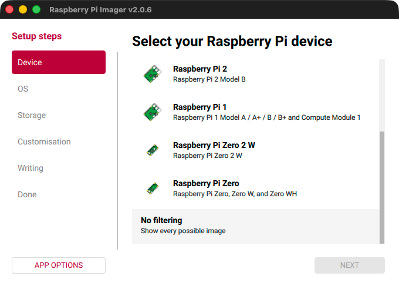
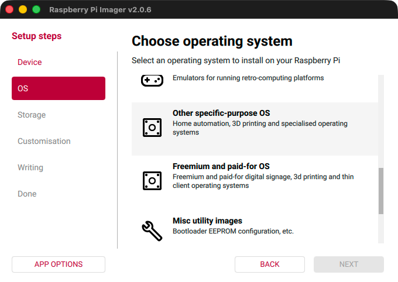
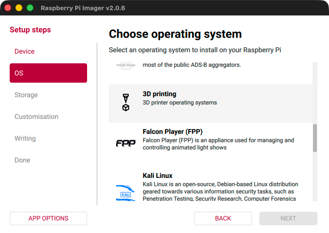
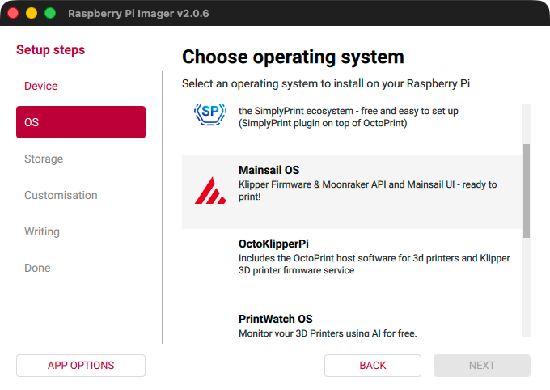
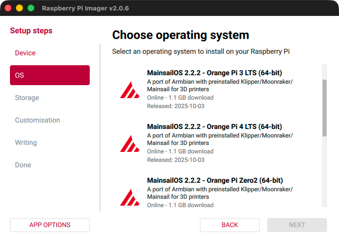
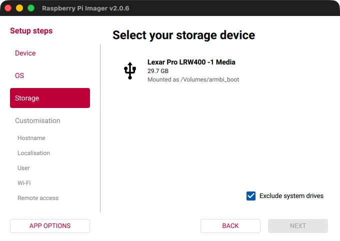
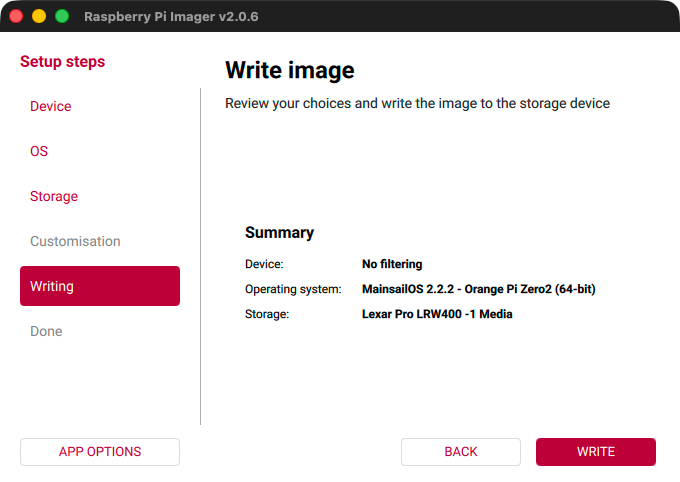
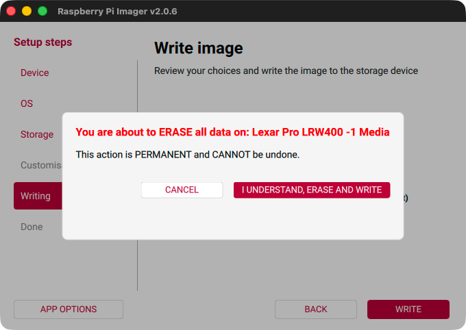
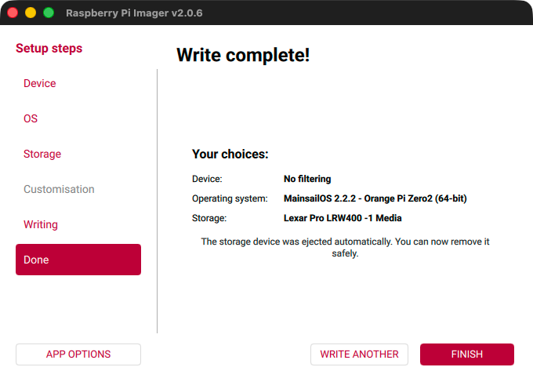

# Armbian

This guide walks you through installing MainsailOS on an Armbian-based SBC (such as Orange Pi) using the Raspberry Pi
Imager.

## Prerequisites

- A supported Armbian-based SBC (e.g., Orange Pi Zero 2, Zero 3, 3 LTS, or 4 LTS)
- A high-quality microSD card (minimum 16 GB, recommended 32 GB or more)
- An SD card reader
- [Raspberry Pi Imager](https://www.raspberrypi.com/software/){:target="_blank"} installed on your computer

!!! warning "SD Card Quality"
    We **strongly** recommend using a high-quality SD card of class **A1** or better from a reputable manufacturer such
    as SanDisk, Kingston, or Samsung. Low-end cards tend to fail quickly in this kind of application.

!!! danger "Data Loss"
    Flashing will **destroy all data** on your SD card. This cannot be reversed. Make sure you select the correct drive.

## Step 1: Prepare

Insert the microSD card into your card reader, connect it to your computer, and launch the
[Raspberry Pi Imager](https://www.raspberrypi.com/software/){:target="_blank"}.

## Step 2: Choose the Device

In the first step of the Raspberry Pi Imager, you will be asked to select the device you want to flash. Since we are
using an Armbian-based SBC, scroll down and select **No filtering** to show all available images.

<figure markdown="span">

</figure>

After selecting **No filtering**, click **Next** to proceed to the next step.

## Step 3: Choose the OS

Now you need to select the correct OS image to flash. In the first level of the menu, you will find some popular
operating systems. Scroll down until you find the **Other specific-purpose OS** category. Click on it to open the next
level of the menu.

<figure markdown="span">

</figure>

After clicking on **Other specific-purpose OS**, you will see the next level of the menu. Here, select **3D printing**.

<figure markdown="span">

</figure>

In the next menu, you will find the MainsailOS image. Click on it to select it.

<figure markdown="span">

</figure>

In the last step, you will see the available MainsailOS images for Armbian-based SBCs. Select the image that matches
your board.

<figure markdown="span">

</figure>

Select your board and click **Next** to proceed to the next step.

## Step 4: Choose the Storage

Now you should see a list of available storage devices. Make sure to select the correct device, as all data on it will
be erased during the flashing process.

<figure markdown="span">

</figure>

Select the correct storage device and click **Next** to proceed to the next step.

## Step 5: Write the Image

Since Armbian-based images do not support the Raspberry Pi Imager's customisation step, you will be taken directly to
the writing summary. Review your selections to make sure everything is correct. If you need to change something, you can
click the "Back" button or use the left sidebar to navigate back to the respective step.

<figure markdown="span">

</figure>

After clicking the "Write" button, you will be asked to confirm that you want to erase all data on the selected storage
device. If you are sure that you have selected the correct device, click "I UNDERSTAND, ERASE AND WRITE" to start the
flashing process.

<figure markdown="span">

</figure>

The flashing process will take a few minutes. When it has finished successfully, a confirmation message will be
displayed.

<figure markdown="span">

</figure>

## Wi-Fi Configuration

Since the customisation step is skipped for Armbian-based images, Wi-Fi is not pre-configured. If your SBC is not
connected via Ethernet, you can set up your Wi-Fi credentials before the first boot. Follow the
[Change WiFi credentials](../faq/change-wifi-credentials.md) guide for instructions.

## Finished 🎉

Safely remove the SD card from your card reader, insert it into your SBC, and continue with the
[First Boot](first-boot.md) guide.
