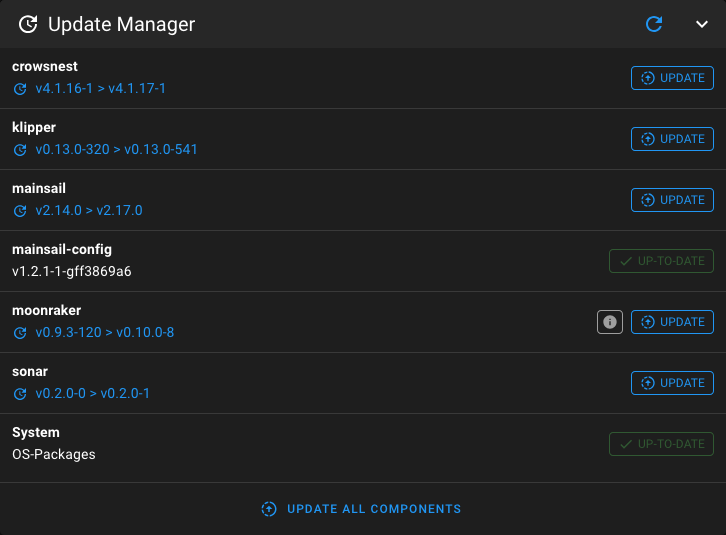
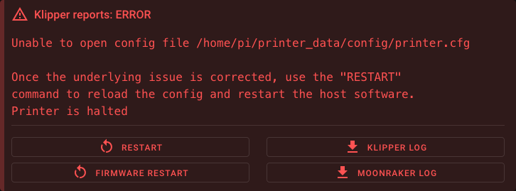

# First Boot

Learn how to set up MainsailOS after flashing it to your SD card. This guide covers the first boot, accessing Mainsail,
and essential configurations for your 3D printer.

## Initial Boot

After MainsailOS has been successfully written to the SD card, insert the card into your device. Connect any necessary
peripherals such as network cable, webcam(s), and the USB cable(s) to your 3D printer. Then power on the device and let
it boot up.

The first start of MainsailOS will take some time to expand the file system. The larger the SD card, the longer this
initial process will take.

!!! note "Raspberry Pi"
    The green LED indicates SD card activity. Once it only flashes occasionally, the process should be complete.

!!! warning "Be Patient"
    This process can take up to **5 minutes** on slower models such as the Pi Zero 2 and Pi 3 series.

## Access Web Interface (Mainsail)

After the boot process has finished, Mainsail will be available at `http://mainsailos.local` or `http://mainsailos`. You
may need to replace `mainsailos` with the hostname you chose while flashing the image.

!!! tip
    If accessing Mainsail using the hostname fails, try connecting to the device's IP address directly. You can look it
    up in your router's admin interface if it is not known.

## Update Manager

To find the Update Manager, select **Machine** in the sidebar navigation. The Update Manager is displayed at the
bottom-right of the Machine page.

When you open the Update Manager for the first time, it may show that some components have updates available.

<figure markdown="span">

<figcaption>Update Manager after first load</figcaption>
</figure>

Click **Update all components** to update everything to the latest version and wait until the installation is complete.
See the [Update Manager](../../update/update-manager.md) documentation for detailed information.

!!! warning "Keep Your System Up to Date"
    We recommend updating all components before you start using your printer. Even though we regularly release new
    versions of MainsailOS, we cannot guarantee that all components (System, Klipper, Moonraker, Mainsail, Crowsnest)
    are up to date at the time of install.

## Klipper Configuration

MainsailOS is a generic image for all Klipper printers. It does not include any Klipper config file (`printer.cfg`).
With no `printer.cfg` present, the following error will be reported:

<figure markdown="span">

<figcaption>Klipper reports: Unable to open config file printer.cfg</figcaption>
</figure>

### Where Can I Get a printer.cfg?

- **Open-source printer communities** often provide a `printer.cfg` for their printers. Check the project's GitHub
  repository or ask on their Discord server.
- **Vendor-supplied configs** — Many vendors add config files for their printers to the
  [Klipper GitHub repository](https://github.com/Klipper3d/klipper/tree/master/config){:target="_blank"}. Look for
  files matching your printer's name that start with `printer-`.
- **Generic board templates** — If you cannot find a fitting `printer.cfg` or you replaced the printer board yourself,
  there are generic board templates in the
  [Klipper repository](https://github.com/Klipper3d/klipper/tree/master/config){:target="_blank"} to help you get
  started. These templates need adjustments to fit your printer setup (axis lengths, bed size, etc.). Look for files
  matching your board name that start with `generic-`.

### Upload Your printer.cfg

To upload your `printer.cfg`, open the **Machine** page in Mainsail and click the **upload-button**, or simply drag and
drop the file into the config file panel. When the upload is complete, click on the **Firmware Restart** button to
restart Klipper and load the new config.

!!! warning "File Name"
    Make sure the file is named exactly `printer.cfg`. Only this name will be recognized by Klipper.

!!! information "Klipper Firmware & Serial Path"
    Your printer board must be flashed with
    [Klipper firmware](https://www.klipper3d.org/Installation.html#building-and-flashing-the-micro-controller){:target="_blank"},
    and the serial path to your printer board must be adjusted in the `printer.cfg` as described in the
    [Klipper documentation](https://www.klipper3d.org/Installation.html#configuring-klipper){:target="_blank"}.

## Mainsail-Specific Klipper Config

After uploading your `printer.cfg` and starting Klipper successfully, you will be confronted with a couple of warnings.

The Mainsail-specific configuration still needs to be added to your Klipper configuration (`printer.cfg`). This
configuration is provided as the `mainsail.cfg`, which is preinstalled on MainsailOS. You just need to include this file
in your `printer.cfg` by adding the following line at the top:

```ini
[include mainsail.cfg]
```

After adding this line, click **SAVE & RESTART** and the warnings should disappear.

!!! information "More infos about mainsail.cfg"
    If you want to know more about what the `mainsail.cfg` does, check out the
    [mainsail.cfg](../../configuration/mainsail-cfg.md) documentation.


## Finished 🎉

Congratulations! Mainsail is now ready to sail! Happy printing!
