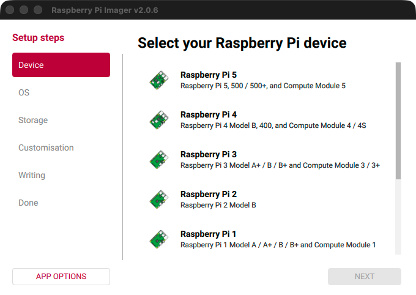
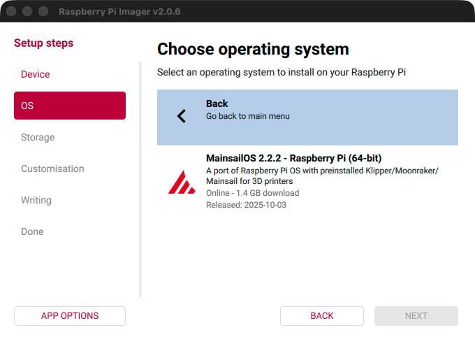
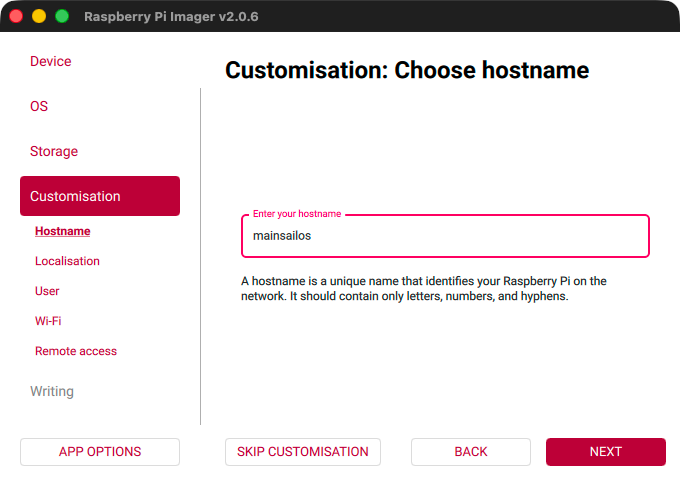
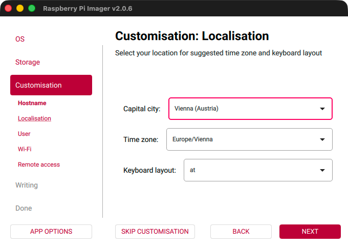
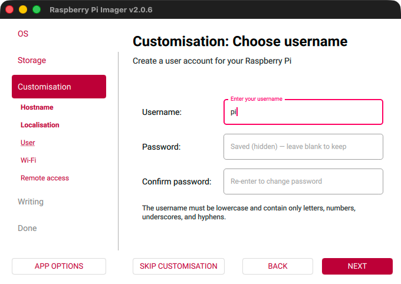
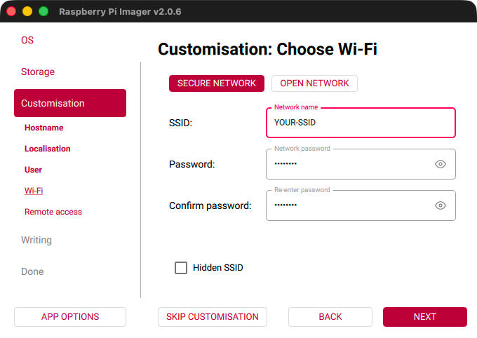
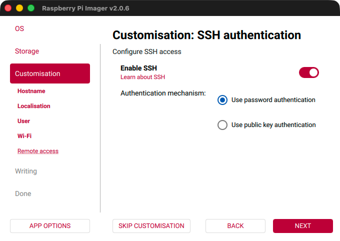
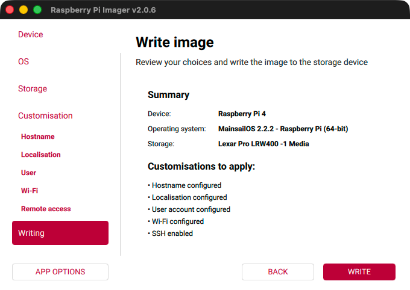
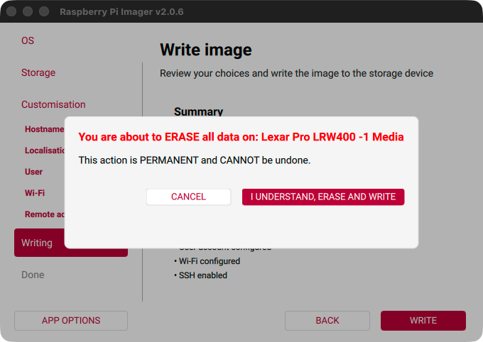
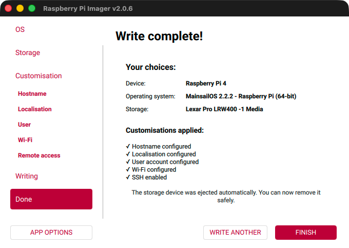

# Raspberry Pi

This guide walks you through installing MainsailOS on a Raspberry Pi using the official Raspberry Pi Imager.

## Prerequisites

- A Raspberry Pi (Zero 2, 3, 4 recommended, Pi 5 supported but not recommended with Webcams)
- A high-quality microSD card (minimum 16 GB, recommended 32 GB or more)
- An SD card reader
- [Raspberry Pi Imager](https://www.raspberrypi.com/software/){:target="_blank"} installed on your computer

!!! warning "SD Card Quality"
    We **strongly** recommend using a high-quality SD card of class **A1** or better from a reputable manufacturer such
    as SanDisk, Kingston, or Samsung. Low-end cards tend to fail quickly in this kind of application.

!!! danger "Data Loss"
    Flashing will **destroy all data** on your SD card. This cannot be reversed. Make sure you select the correct drive.

## Step 1: Prepare

Insert the microSD card into your card reader, connect it to your computer, and launch the
[Raspberry Pi Imager](https://www.raspberrypi.com/software/){:target="_blank"}.

## Step 2: Choose the Device

In the first step of the Raspberry Pi Imager, you will be asked to select the device you want to flash. This is where
you select the model of your Raspberry Pi. The Imager will show you a list of devices.

<figure markdown="span">

</figure>

After selecting your device, click **Next** to proceed to the next step.

## Step 3: Choose the OS

Now you need to select the correct OS image to flash. In the first level of the menu, you will find some popular
operating systems. Scroll down until you find the **Other specific-purpose OS** category. Click on it to open the next
level of the menu.

<figure markdown="span">

</figure>

After clicking on **Other specific-purpose OS**, you will see the next level of the menu. Here, select **3D printing**.

<figure markdown="span">

</figure>

In the next menu, you will find the MainsailOS image. Click on it to select it.

<figure markdown="span">

</figure>

In the last step, you will be asked to select the version of MainsailOS you want to install. If you use a Raspberry Pi
Zero 2 or higher, you should only see one option, which is the recommended version. If you have an older Raspberry Pi
model, you will also see the deprecated 32-bit version. We recommend using the 64-bit version if your device supports
it, as it will provide better performance and stability.

<figure markdown="span">

</figure>

Select the version and click **Next** to proceed to the next step.

## Step 4: Choose the Storage

Now you should see a list of available storage devices. In my case, it listed my "Lexar Pro LRW400" SD card reader with
a 32 GB card inserted. Make sure to select the correct device, as all data on it will be erased during the flashing
process.

<figure markdown="span">

</figure>

Select the correct storage device and click **Next** to proceed to the next step.

## Step 5: Customisation

Before writing, the Raspberry Pi Imager will ask you for some custom settings.

### Hostname

In the first step, it will ask you to set a hostname for your device. The default is `mainsailos`, if you leave it
empty. The hostname is used to identify your device on the network. After the first boot, you will be able to access
your printer at `http://<hostname>.local` in your browser.

<figure markdown="span">

</figure>

### Localisation

In the next step, you can set your localisation settings. This includes your Capital city, Timezone, and Keyboard
layout. Setting the correct timezone is important for accurate timestamps in logs and timelapse videos. The keyboard
layout is only relevant if you plan to connect a keyboard and display to your Raspberry Pi.

<figure markdown="span">

</figure>

### User

In the next step, you can set your username and password. The default username is `pi` and the default password is
`raspberry`. We recommend changing the default password for security reasons.

<figure markdown="span">

</figure>

### Wi-Fi

In the next step, you can set your Wi-Fi settings. This includes your SSID and password. As the Wi-Fi country, your
localisation settings will be used.

<figure markdown="span">

</figure>

### Remote access

In the last step, you can enable SSH for remote access. This is required to log in to your device remotely without a
keyboard and display connected. We recommend enabling SSH, as it will allow you to easily access your Raspberry Pi for
troubleshooting and configuration.

<figure markdown="span">

</figure>

## Step 6: Write the Image

After setting all the customisation options, you will see a summary of your selections. Review them to make sure
everything is correct. If you need to change something, you can click the "Back" button or use the left sidebar to
navigate back to the respective step.

<figure markdown="span">

</figure>

After clicking the "Write" button, you will be asked to confirm that you want to erase all data on the selected storage
device. If you are sure that you have selected the correct device, click "I UNDERSTAND, ERASE AND WRITE" to start the
flashing process.

<figure markdown="span">

</figure>

The flashing process will take a few minutes. When it has finished successfully, a confirmation message will be
displayed.

<figure markdown="span">

</figure>

## Finished 🎉

Safely remove the SD card from your card reader, insert it into your Raspberry Pi, and continue with the
[First Boot](first-boot.md) guide.
