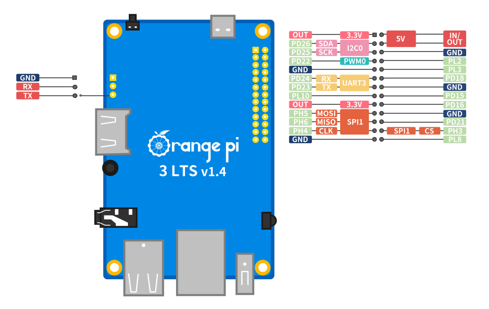

# Orange Pi 3 LTS

You can use the Orange Pi 3 LTS, an SBC based on the Allwinner H6 SoC. Your board provides a 26-pin GPIO header and is
supported by MainsailOS through an Armbian-based image.

## Board Overview

| Property       | Value                |
|----------------|----------------------|
| SoC            | Allwinner H6         |
| RAM            | 2 GB                 |
| Base Image     | Armbian CLI          |
| GPIO Header    | 26-pin               |

## GPIO Pinout

<figure markdown="span">

<figcaption>Orange Pi 3 LTS 26-pin GPIO header pinout</figcaption>
</figure>

## GPIO Chip

When using GPIOs with the [Linux MCU](../faq/linux-mcu.md) in Klipper, you need to identify the correct GPIO chip and
line number for each pin. The H6 SoC exposes two GPIO controllers:

| GPIO Chip    | Controller | Ports  |
|--------------|------------|--------|
| `gpiochip0`  | r_pio      | PL     |
| `gpiochip1`  | pio        | PA–PH  |

### Header Pin Mapping

The following table lists all GPIO pins on the 26-pin header with their Klipper pin references:

| Pin Name | GPIO Chip    | Line | Klipper Pin                |
|----------|--------------|------|----------------------------|
| PD15     | `gpiochip1`  | 111  | `host:gpiochip1/gpio111`   |
| PD16     | `gpiochip1`  | 112  | `host:gpiochip1/gpio112`   |
| PD18     | `gpiochip1`  | 114  | `host:gpiochip1/gpio114`   |
| PD21     | `gpiochip1`  | 117  | `host:gpiochip1/gpio117`   |
| PD22     | `gpiochip1`  | 118  | `host:gpiochip1/gpio118`   |
| PD23     | `gpiochip1`  | 119  | `host:gpiochip1/gpio119`   |
| PD24     | `gpiochip1`  | 120  | `host:gpiochip1/gpio120`   |
| PD25     | `gpiochip1`  | 121  | `host:gpiochip1/gpio121`   |
| PD26     | `gpiochip1`  | 122  | `host:gpiochip1/gpio122`   |
| PH3      | `gpiochip1`  | 227  | `host:gpiochip1/gpio227`   |
| PH4      | `gpiochip1`  | 228  | `host:gpiochip1/gpio228`   |
| PH5      | `gpiochip1`  | 229  | `host:gpiochip1/gpio229`   |
| PH6      | `gpiochip1`  | 230  | `host:gpiochip1/gpio230`   |
| PL2      | `gpiochip0`  | 2    | `host:gpiochip0/gpio2`     |
| PL3      | `gpiochip0`  | 3    | `host:gpiochip0/gpio3`     |
| PL8      | `gpiochip0`  | 8    | `host:gpiochip0/gpio8`     |
| PL10     | `gpiochip0`  | 10   | `host:gpiochip0/gpio10`    |

!!! warning "Pins with Dedicated Functions"
    Some header pins serve dedicated roles (UART, SPI, I2C). Avoid using them as general-purpose GPIOs if the
    corresponding overlay is enabled. Refer to the [GPIO Pinout](#gpio-pinout) diagram for pin functions.

### Calculating GPIO Line Numbers

Allwinner SoCs use a simple formula to convert pin names (e.g., PH3) to GPIO line numbers:

```text
line number = port base + pin number
```

Where port base values are: PA=0, PB=32, PC=64, PD=96, PE=128, PF=160, PG=192, PH=224, PL=0.

!!! note
    Port PL belongs to `gpiochip0` (r_pio) and starts at base 0. All other ports belong to `gpiochip1` (pio).

**Example:** PH3 → port base 224 + pin 3 = **227** → Klipper pin: `host:gpiochip1/gpio227`

## UART

UART3 is **enabled by default** in MainsailOS via the `uart3` device tree overlay. The UART is immediately available
after the first boot.

| Interface | Device Path   | Overlay  | TX Pin | RX Pin |
|-----------|---------------|----------|--------|--------|
| UART3     | `/dev/ttyS3`  | `uart3`  | PD23   | PD24   |

!!! warning "Cross the TX/RX Lines"
    The TX pin of the SBC connects to the RX pin on the MCU, and vice versa.

!!! info "Debug UART"
    The Orange Pi 3 LTS has a dedicated 3-pin debug UART header (GND, RX, TX) on the board. This is intended for
    serial console access and is **not** suitable for MCU communication.

## SPI

SPI1 is **enabled by default** in MainsailOS via the `spi-spidev1` device tree overlay and the `spi-dev` kernel module.
It is pre-configured for use with accelerometers for
[Input Shaper](https://www.klipper3d.org/Measuring_Resonances.html){:target="_blank"}.

The SPI device is available at `/dev/spidev1.0`.

| Function | GPIO Pin |
|----------|----------|
| MOSI     | PH5      |
| MISO     | PH6      |
| SCLK     | PH4      |
| CS       | PH3      |

Example Klipper configuration for an ADXL345 accelerometer:

```ini
[adxl345]
cs_pin: host:gpiochip1/gpio227
spi_bus: spidev1.0
```

!!! tip "CS Pin"
    The PH3 pin maps to `gpiochip1/gpio227`. See the [Header Pin Mapping](#header-pin-mapping) for all pin
    references.

## I2C

I2C0 is **enabled by default** in MainsailOS via the `i2c0` device tree overlay. The I2C device is available at
`/dev/i2c-0`.

| Interface | Overlay | Device Path  | SDA Pin | SCL Pin |
|-----------|---------|--------------|---------|---------|
| I2C0      | `i2c0`  | `/dev/i2c-0` | PD26    | PD25    |

In your Klipper configuration, use `i2c_bus: i2c.0`:

```ini
[temperature_sensor example]
sensor_type: HTU21D
i2c_mcu: host
i2c_bus: i2c.0
```

!!! warning "I2C Bus Number"
    The overlay name and the actual `/dev/i2c-*` device number may differ. Always verify with `ls /dev/i2c-*` after
    enabling the overlay and rebooting.

## Further Resources

- [Orange Pi 3 LTS — Official Page](http://www.orangepi.org/html/hardWare/computerAndMicrocontrollers/service-and-support/Orange-pi-3-LTS.html){:target="_blank"}
- [Armbian Documentation](https://docs.armbian.com/){:target="_blank"}
- [Klipper RPi Microcontroller](https://www.klipper3d.org/RPi_microcontroller.html){:target="_blank"} — Klipper Linux MCU guide
