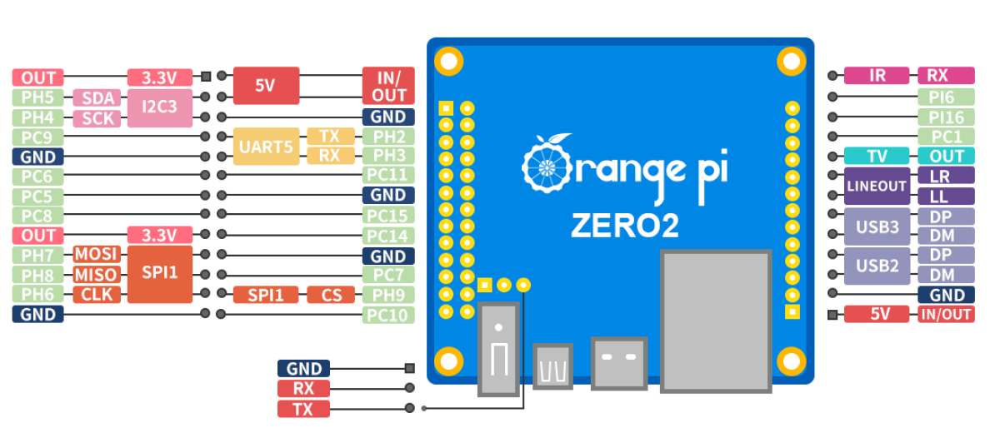

# Orange Pi Zero 2

The Orange Pi Zero 2 is a compact SBC based on the Allwinner H616 SoC. It features a 26-pin GPIO header and is
supported by MainsailOS through an Armbian-based image.

## Board Overview

| Property       | Value                |
|----------------|----------------------|
| SoC            | Allwinner H616       |
| RAM            | 1 GB / 1.5 GB        |
| Base Image     | Armbian CLI          |
| GPIO Header    | 26-pin               |

## GPIO Pinout

<figure markdown="span">

<figcaption>Orange Pi Zero 2 26-pin GPIO header pinout</figcaption>
</figure>

## GPIO Chip

When using GPIOs with the [Linux MCU](../faq/linux-mcu.md) in Klipper, you need to identify the correct GPIO chip and
line number for each pin. The H616 SoC exposes two GPIO controllers:

| GPIO Chip    | Controller | Ports  |
|--------------|------------|--------|
| `gpiochip0`  | r_pio      | PL     |
| `gpiochip1`  | pio        | PA–PI  |

### Header Pin Mapping

The following table lists all GPIO pins on the 26-pin header with their Klipper pin references:

| Pin Name | GPIO Chip    | Line | Klipper Pin                |
|----------|--------------|------|----------------------------|
| PC5      | `gpiochip1`  | 69   | `host:gpiochip1/gpio69`    |
| PC6      | `gpiochip1`  | 70   | `host:gpiochip1/gpio70`    |
| PC7      | `gpiochip1`  | 71   | `host:gpiochip1/gpio71`    |
| PC8      | `gpiochip1`  | 72   | `host:gpiochip1/gpio72`    |
| PC9      | `gpiochip1`  | 73   | `host:gpiochip1/gpio73`    |
| PC10     | `gpiochip1`  | 74   | `host:gpiochip1/gpio74`    |
| PC11     | `gpiochip1`  | 75   | `host:gpiochip1/gpio75`    |
| PC14     | `gpiochip1`  | 78   | `host:gpiochip1/gpio78`    |
| PC15     | `gpiochip1`  | 79   | `host:gpiochip1/gpio79`    |
| PH2      | `gpiochip1`  | 226  | `host:gpiochip1/gpio226`   |
| PH3      | `gpiochip1`  | 227  | `host:gpiochip1/gpio227`   |
| PH4      | `gpiochip1`  | 228  | `host:gpiochip1/gpio228`   |
| PH5      | `gpiochip1`  | 229  | `host:gpiochip1/gpio229`   |
| PH6      | `gpiochip1`  | 230  | `host:gpiochip1/gpio230`   |
| PH7      | `gpiochip1`  | 231  | `host:gpiochip1/gpio231`   |
| PH8      | `gpiochip1`  | 232  | `host:gpiochip1/gpio232`   |
| PH9      | `gpiochip1`  | 233  | `host:gpiochip1/gpio233`   |

!!! warning "Pins with Dedicated Functions"
    Some header pins serve dedicated roles (UART, SPI, I2C). Avoid using them as general-purpose GPIOs if the
    corresponding overlay is enabled. Refer to the [GPIO Pinout](#gpio-pinout) diagram for pin functions.

### Calculating GPIO Line Numbers

Allwinner SoCs use a simple formula to convert pin names (e.g., PH9) to GPIO line numbers:

```text
line number = port base + pin number
```

| Port | Base |
|------|------|
| PA   | 0    |
| PB   | 32   |
| PC   | 64   |
| PD   | 96   |
| PE   | 128  |
| PF   | 160  |
| PG   | 192  |
| PH   | 224  |
| PI   | 256  |
| PL   | 0    |

!!! note
    Port PL belongs to `gpiochip0` (r_pio) and starts at base 0. All other ports belong to `gpiochip1` (pio).

**Example:** PH9 → port base 224 + pin 9 = **233** → Klipper pin: `host:gpiochip1/gpio233`

## UART

UART5 is **enabled by default** in MainsailOS via the `uart5` device tree overlay. The UART is immediately available
after the first boot.

| Interface | Device Path   | Overlay  | TX Pin        | RX Pin         |
|-----------|---------------|----------|---------------|----------------|
| UART5     | `/dev/ttyS1`  | `uart5`  | PH2 (Pin 8)   | PH3 (Pin 10)   |

!!! warning "Cross the TX/RX Lines"
    The TX pin of the SBC connects to the RX pin on the MCU, and vice versa.

!!! info "Debug UART"
    The Orange Pi Zero 2 has a dedicated 3-pin debug UART header (GND, RX, TX) on the board. This is intended for
    serial console access and is **not** suitable for MCU communication.

## SPI

SPI1 is **enabled by default** in MainsailOS via the `spi-spidev` and `spidev1_1` device tree overlays. It is
pre-configured for use with accelerometers for
[Input Shaper](https://www.klipper3d.org/Measuring_Resonances.html){:target="_blank"}.

The SPI device is available at `/dev/spidev1.1`.

| Function | GPIO Pin |
|----------|----------|
| MOSI     | PH7      |
| MISO     | PH8      |
| SCLK     | PH6      |
| CS       | PH9      |

Example Klipper configuration for an ADXL345 accelerometer:

```ini
[adxl345]
cs_pin: host:gpiochip1/gpio233
spi_bus: spidev1.1
```

## I2C

I2C3 is **enabled by default** in MainsailOS via the `i2c3-ph` device tree overlay. The I2C device is available at
`/dev/i2c-1`.

| Interface | Overlay    | Device Path  | SDA Pin | SCL Pin |
|-----------|------------|--------------|---------|---------|
| I2C3      | `i2c3-ph`  | `/dev/i2c-1` | PH5     | PH4     |

In your Klipper configuration, use `i2c_bus: i2c.1`:

```ini
[temperature_sensor example]
sensor_type: HTU21D
i2c_mcu: host
i2c_bus: i2c.1
```

!!! warning "I2C Bus Number"
    Note that the overlay is called `i2c3-ph` but the device is exposed as `/dev/i2c-1`. Use `i2c.1` (not `i2c.3`) in
    your Klipper configuration.

## Further Resources

- [Orange Pi Zero 2 — Official Page](http://www.orangepi.org/html/hardWare/computerAndMicrocontrollers/service-and-support/Orange-Pi-Zero-2.html){:target="_blank"}
- [Armbian Documentation](https://docs.armbian.com/){:target="_blank"}
- [Klipper RPi Microcontroller](https://www.klipper3d.org/RPi_microcontroller.html){:target="_blank"} — Klipper Linux MCU guide
