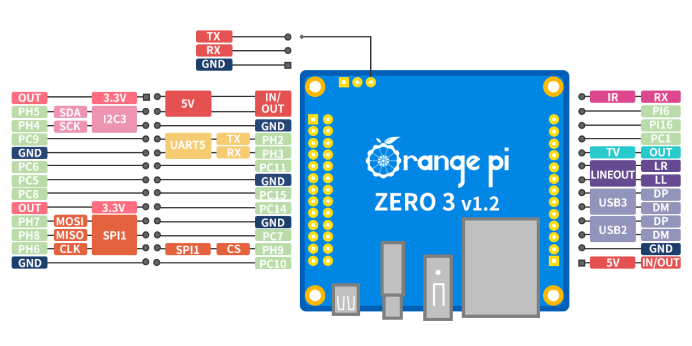

# Orange Pi Zero 3

The Orange Pi Zero 3 is a compact SBC based on the Allwinner H618 SoC. It features a 26-pin GPIO header and is
supported by MainsailOS through an Armbian-based image.

## Board Overview

| Property       | Value                       |
|----------------|-----------------------------|
| SoC            | Allwinner H618              |
| RAM            | 1 GB / 1.5 GB / 2 GB / 4 GB |
| Base Image     | Armbian CLI                 |
| GPIO Header    | 26-pin                      |

## GPIO Pinout

<figure markdown="span">

<figcaption>Orange Pi Zero 3 26-pin GPIO header pinout</figcaption>
</figure>

## GPIO Chip

When using GPIOs with the [Linux MCU](../faq/linux-mcu.md) in Klipper, you need to identify the correct GPIO chip for
your pins. The H618 SoC uses multiple GPIO chips.

Run the following to list available chips and their lines:

```bash
sudo apt install gpiod
gpioinfo
```

Example Klipper configuration:

```ini
[output_pin example]
pin: host:gpiochip0/gpio20
```

!!! tip "Finding the Right Chip and Line"
    Use `gpioinfo` to find the GPIO chip and line number for the pin you want to use. The chip and line mapping depends
    on the Armbian device tree configuration.

## UART

UART5 is **enabled by default** in MainsailOS via the `uart5` device tree overlay. The UART is immediately available
after the first boot.

| Interface | Device Path   | Overlay  | TX Pin        | RX Pin         |
|-----------|---------------|----------|---------------|----------------|
| UART5     | `/dev/ttyS1`  | `uart5`  | PH2 (Pin 8)   | PH3 (Pin 10)   |

!!! warning "Cross the TX/RX Lines"
    The TX pin of the SBC connects to the RX pin on the MCU, and vice versa.

!!! info "Debug UART"
    The Orange Pi Zero 3 has a dedicated 3-pin debug UART header (GND, RX, TX) on the board. This is intended for
    serial console access and is **not** suitable for MCU communication.

## SPI

SPI1 is **enabled by default** in MainsailOS via the `spi-spidev` and `spidev1_1` device tree overlays. It is
pre-configured for use with accelerometers for
[Input Shaper](https://www.klipper3d.org/Measuring_Resonances.html){:target="_blank"}.

The SPI device is available at `/dev/spidev1.1`.

| Function | GPIO Pin |
|----------|----------|
| MOSI     | PH7      |
| MISO     | PH8      |
| SCLK     | PH6      |
| CS       | PH9      |

Example Klipper configuration for an ADXL345 accelerometer:

```ini
[adxl345]
cs_pin: host:gpiochip1/gpio233
spi_bus: spidev1.1
```

## I2C

I2C3 is **enabled by default** in MainsailOS via the `i2c3-ph` device tree overlay. The I2C device is available at
`/dev/i2c-2`.

| Interface | Overlay    | Device Path  | SDA Pin | SCL Pin |
|-----------|------------|--------------|---------|---------|
| I2C3      | `i2c3-ph`  | `/dev/i2c-2` | PH5     | PH4     |

In your Klipper configuration, use `i2c_bus: i2c.2`:

```ini
[temperature_sensor example]
sensor_type: HTU21D
i2c_mcu: host
i2c_bus: i2c.2
```

!!! warning "I2C Bus Number"
    Note that the overlay is called `i2c3-ph` but the device is exposed as `/dev/i2c-2`. Use `i2c.2` (not `i2c.3`) in
    your Klipper configuration.

## Further Resources

- [Orange Pi Zero 3 — Official Page](http://www.orangepi.org/html/hardWare/computerAndMicrocontrollers/service-and-support/Orange-Pi-Zero-3.html){:target="_blank"}
- [Armbian Documentation](https://docs.armbian.com/){:target="_blank"}
- [Klipper RPi Microcontroller](https://www.klipper3d.org/RPi_microcontroller.html){:target="_blank"} — Klipper Linux MCU guide
