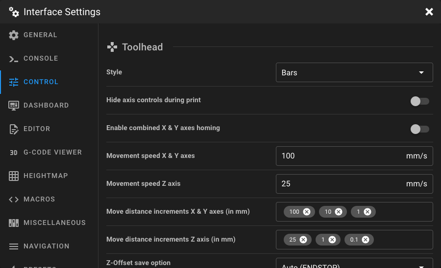
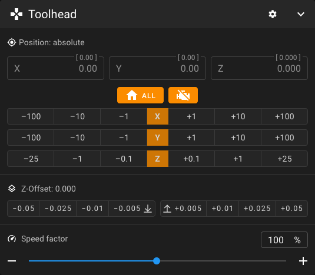
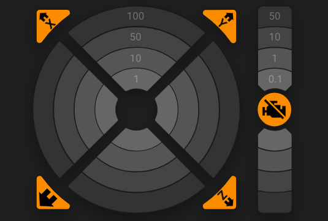
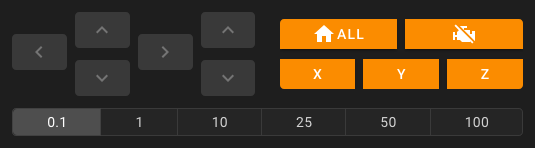
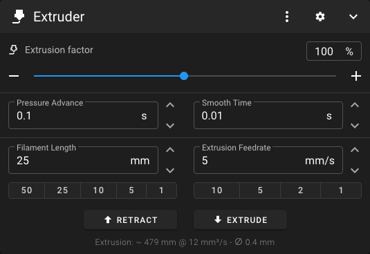

# Control Settings

Open the **Interface Settings** by clicking the **cogs icon** in the top-right corner, then
navigate to **Control**.

<figure markdown="span">

</figure>

## Toolhead

This section allows you to customize the toolhead panel on the Dashboard.

<figure markdown="span">

</figure>

### Style

Choose the appearance of the toolhead motion controls on the Dashboard.

=== "Bars (default)"

    Simple horizontal bars for each axis.

    <figure markdown="span">
    
    </figure>

=== "Circle"

    Circular control pad for X/Y movement with a separate Z column.

    <figure markdown="span">
    
    </figure>

=== "Cross"

    Cross-shaped directional pad for X/Y movement with a separate Z column.

    <figure markdown="span">
    
    </figure>

!!! note
    Some settings below are only available for specific control styles. The available move distance options change
    depending on the selected style.

### Overwrite Action Button

Override the action button displayed in the center of the toolhead control. This option is only available when using the
**Circle** or **Cross** style and when multiple actions are available.

| Option                | Description                                               |
|-----------------------|-----------------------------------------------------------|
| **Motors off**        | Sends `M84` to disable stepper motors.                    |
| **Quad Gantry Level** | Runs `QUAD_GANTRY_LEVEL` (only if configured in Klipper). |
| **Z-Tilt Adjust**     | Runs `Z_TILT_ADJUST` (only if configured in Klipper).     |

The default action is automatically selected based on your Klipper configuration.

### Hide Axis Controls During Print

When enabled, the toolhead movement controls are hidden while a print is in progress. This prevents accidental movements
during a print.

### Enable Combined X & Y Axes Homing

When enabled, a single button homes both the X and Y axes together. When disabled, separate homing buttons are shown for
each axis.

### Invert X Axis Movement Direction

Inverts the direction of the X axis when moving through the interface.

### Invert Y Axis Movement Direction

Inverts the direction of the Y axis when moving through the interface.

### Invert Z Axis Movement Direction

Inverts the direction of the Z axis when moving through the interface. This is useful for printers where you prefer to
think in terms of bed movement rather than toolhead movement. For example, on a CoreXY printer with this option enabled,
moving Z in the negative direction sends the print bed down (away from the toolhead), instead of the toolhead moving
down towards the bed.

!!! note
    The invert axis options are only available when using the **Circle** or **Cross** style, and it only inverts the
    sending of movement commands from the interface. It does not change the actual printer configuration or the
    direction of movement when using physical controls or G-Code commands.

### Movement Speed X & Y Axes

Set the movement speed (in mm/s) used when moving the X and Y axes through the toolhead controls. The value must be
greater than 0.

### Movement Speed Z Axis

Set the movement speed (in mm/s) used when moving the Z axis through the toolhead controls. The value must be greater
than 0.

### Move Distance Increments

Customize the selectable move distances (in mm) for the toolhead controls. The available options depend on the selected
control style:

| Style      | Fields                               | Max Values |
|------------|--------------------------------------|------------|
| **Cross**  | Combined move distances for all axes | 9          |
| **Circle** | Separate X/Y and Z move distances    | 4 each     |
| **Bars**   | Separate X/Y and Z move distances    | 3 each     |

Enter values and press **enter** to add them. You can remove values by clicking the `×` on each chip.

### Z-Offset Save Option

Select which Klipper command is used when saving the Z-offset. This option is only available when an endstop pin is
configured or a probe is configured in your Klipper setup (the available options depend on your configuration).

| Option               | Description                                                                |
|----------------------|----------------------------------------------------------------------------|
| **Auto** *(default)* | Automatically selects the best option based on your Klipper configuration. |
| **ENDSTOP**          | Uses `Z_OFFSET_APPLY_ENDSTOP` to save the offset to the endstop.           |
| **PROBE**            | Uses `Z_OFFSET_APPLY_PROBE` to save the offset to the probe.               |

### Z-Offset Increments

Customize the selectable increment values (in mm) for adjusting the Z-offset. A maximum of 4 values are allowed.

## Extruder

This section allows you to customize the extruder panel on the Dashboard.

<figure markdown="span">

</figure>

### Extrusion Amount Presets

Define preset filament lengths in mm for quick extrusion via the extruder control panel. A maximum of 5 values are
recommended for best visibility.

!!! tip
    You can also enter a custom extrusion amount directly in the extruder control panel on the Dashboard.

### Extrusion Speed Presets

Define preset extrusion speeds in mm/s for the extruder control panel. A maximum of 5 values are recommended for best
visibility. Once you have determined the maximum extrusion speed of your hotend, you may want to add it here.

!!! tip
    You can also enter a custom extrusion speed directly in the extruder control panel on the     Dashboard.

### Show Estimated Extrusion Info

When enabled, the extruder control panel displays an estimation of the extrusion based on the selected extrusion amount
and feedrate. Disable this option to hide the calculation.
