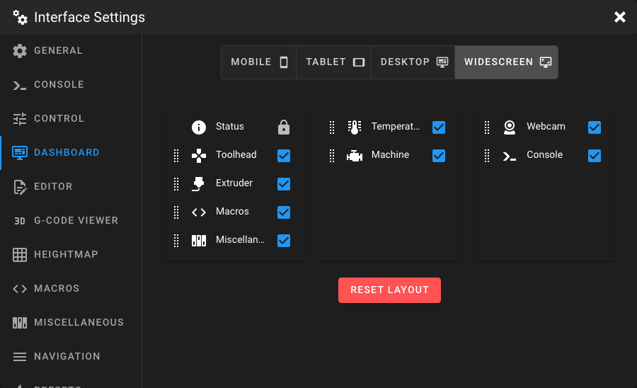

# Dashboard Settings

Open the **Interface Settings** by clicking the **cogs icon** in the top-right corner, then navigate to **Dashboard**.

<figure markdown="span">

</figure>

## Device Classes

The Dashboard layout can be configured independently for each device class. Select the device class you want to
customize using the toggle buttons at the top:

| Device Class   | Columns | Description                                                                               |
|----------------|---------|-------------------------------------------------------------------------------------------|
| **Mobile**     | 1       | Single-column layout for smartphones.                                                     |
| **Tablet**     | 2       | Two-column layout for tablets.                                                            |
| **Desktop**    | 2       | Two-column layout for standard desktop screens. (the right column is a little bit bigger) |
| **Widescreen** | 3       | Three-column layout for wide monitors.                                                    |

Mainsail automatically selects the matching device class based on your current screen size. This allows you to hide
certain panels on mobile devices that are visible on desktop, or arrange panels in a completely different order
depending on the screen.

## Arranging Panels

Each column displays a list of available panels. You can customize the layout by:

- **Drag and drop** panels to reorder them within a column or move them between columns.
- **Toggle visibility** of each panel using the eye icon — hidden panels remain in the list but are not shown on the
    Dashboard.

<video controls autoplay loop muted>
  <source src="../images/settings/dashboard-drag-and-drop.mp4" type="video/mp4">
</video>

!!! note
    The **Status** panel is always locked to the top of the first column and cannot be moved or hidden.

## Reset Layout

Click the **Reset Layout** button at the bottom to restore the default panel arrangement for the currently selected
device class. This resets both the order and visibility of all panels.

!!! warning
    This action cannot be undone. Only the layout of the currently selected device class is
    reset.
