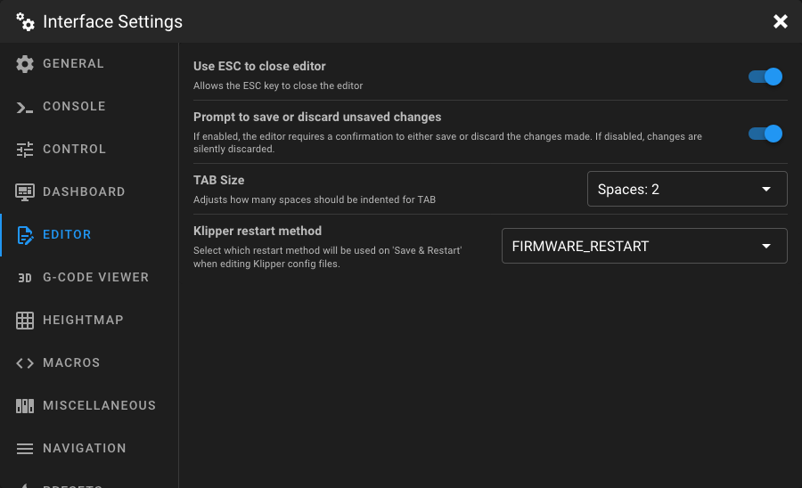

# Editor Settings

Open the **Interface Settings** by clicking the **cogs icon** in the top-right corner, then navigate to **Editor**.

<figure markdown="span">
  
</figure>

## Use ESC to Close Editor

When enabled, pressing the **esc** key closes the editor. Disable this option if you prefer to close the editor only via
the close button.

## Prompt to Save or Discard Unsaved Changes

When enabled, the editor shows a confirmation dialog when closing with unsaved changes, giving you the option to either
save or discard your modifications. When disabled, unsaved changes are silently discarded.

## TAB Size

Adjusts how many spaces are inserted when pressing the **tab** key in the editor.

| Option                    | Description            |
|---------------------------|------------------------|
| **Spaces: 2** *(default)* | Indents with 2 spaces. |
| **Spaces: 4**             | Indents with 4 spaces. |
| **Spaces: 6**             | Indents with 6 spaces. |
| **Spaces: 8**             | Indents with 8 spaces. |

## Klipper Restart Method

Select which restart method is used when clicking **Save & Restart** after editing a Klipper config file.

| Option                           | Description                                                                                                                                               |
|----------------------------------|-----------------------------------------------------------------------------------------------------------------------------------------------------------|
| **FIRMWARE_RESTART** *(default)* | Sends `FIRMWARE_RESTART`. This also restart all MCUs and load the new MCU firmware configuration. This is the recommended option for most config changes. |
| **RESTART**                      | Sends `RESTART`. This only restart Klippy on the host and will not restart the MCUs.                                                                      |
