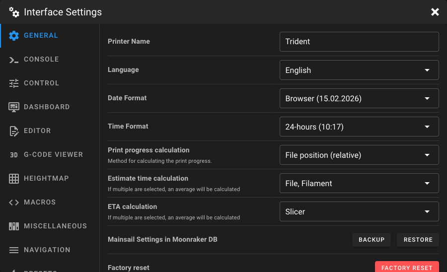
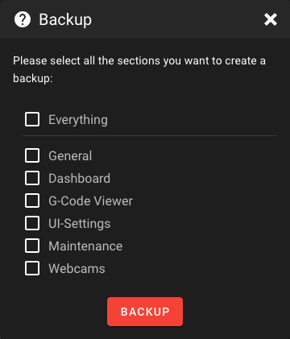
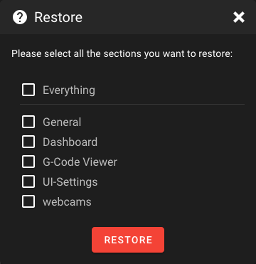

# General Settings

Open the **Interface Settings** by clicking the **cogs icon** in the top-right corner, then
navigate to **General**.

<figure markdown="span">
  
</figure>

## Printer Name

Assign a name for your printer. This name is displayed in the top bar, in printer selection
menus, and in the print farm overview.

## Language

Choose the language in which you want to use Mainsail. Please do not use a browser translation, because it may break the
UI and cause issues when you try to open a config file and the browser tries to translate the file content. Instead,
select your language from the dropdown menu.

!!! note
    Translations are created by the community. If you find a missing or incorrect translation,
    you can help improve them. Learn how to contribute in the [Localization guide](../development/localization.md).

## Date Format

Choose your preferred date format. The following formats are available:

| Format              | Example                        |
|---------------------|--------------------------------|
| Browser *(default)* | Depends on your browser locale |
| SHORT               | Short locale format            |
| ISO                 | 2026-02-14                     |
| mm-dd-yyyy          | 02-14-2026                     |
| mm-dd-yy            | 02-14-26                       |
| m-d-yyyy            | 14-02-2026                     |
| m-d-yy              | 14-02-26                       |
| dd-mm-yyyy          | 14-02-2026                     |
| dd-mm-yy            | 14-02-26                       |
| dd.mm.yyyy          | 14.02.2026                     |
| dd.mm.yy            | 14.02.26                       |
| yyyy. mm. dd.       | 2026. 02. 14.                  |
| yy. mm. dd.         | 26. 02. 14.                    |

By default, Mainsail uses your browser's locale format, so if you want to change the date format, you can either select
a specific format from the dropdown or change your browser's locale settings.

## Time Format

Choose your preferred time format:

| Format              | Description                       |
|---------------------|-----------------------------------|
| Browser *(default)* | Uses your browser's locale format |
| 24-hours            | e.g. 14:30                        |
| 12-hours            | e.g. 2:30 PM                      |

## Print Progress Calculation

Select the method used to calculate the print progress percentage. Which will be used in the Dashboard, print farm
overview and in the browser tab.

| Method                       | Description                                                                                                                                                                                                                                    |
|------------------------------|------------------------------------------------------------------------------------------------------------------------------------------------------------------------------------------------------------------------------------------------|
| **File position (relative)** | Progress is calculated based on the file position, excluding start and end G-Code metadata. For example, if your file has 100 bytes of metadata at the beginning and end, only the G-Code portion in between is used for progress calculation. |
| **File position (absolute)** | Progress is calculated based on the absolute file position, including start and end G-Code metadata.                                                                                                                                           |
| **Slicer (M73)**             | Mainsail displays the print progress reported by `M73` G-Code commands from the slicer. Falls back to absolute file progress if no `M73` commands are present.                                                                                 |
| **Filament**                 | Progress is calculated based on how much filament has been fed compared to the total filament length estimated by the slicer. For example, if your print requires 1000 mm of filament and 200 mm have been fed, the progress is 20%.           |

## Estimate Time Calculation

Select the factors used to calculate the **estimated remaining print time**. If multiple factors are selected, an
average of all selected factors is calculated.

| Factor       | Description                                                                                                                                                                                                                                                                                                                                                          |
|--------------|----------------------------------------------------------------------------------------------------------------------------------------------------------------------------------------------------------------------------------------------------------------------------------------------------------------------------------------------------------------------|
| **File**     | The remaining time is calculated based on the progress of the file and the elapsed print time. For example, if your file has 100 bytes of metadata at the beginning and end, and the file is 1200 bytes total, the progress is calculated only for the 1000 bytes of G-Code in between. Based on this progress and the print time, the remaining time is determined. |
| **Filament** | The remaining time is calculated based on the filament length already fed and the elapsed print time. For example, if your print requires 1000 mm of filament and 200 mm have been fed, this represents 20% progress. The remaining time is calculated from this progress and the print time.                                                                        |

## ETA Calculation

Select the factors used to calculate the **ETA** (estimated time of arrival) — the expected time when the print will be
completed. If multiple factors are selected, an average of all selected factors is calculated.

| Factor       | Description                                                                                                                                                                  |
|--------------|------------------------------------------------------------------------------------------------------------------------------------------------------------------------------|
| **File**     | The ETA is calculated based on the progress of the file and the elapsed print time. Metadata at the beginning and end of the file is excluded from the progress calculation. |
| **Filament** | The ETA is calculated based on the filament length already fed compared to the total filament required, combined with the elapsed print time.                                |
| **Slicer**   | Similar to the file factor, but uses the slicer's estimated total print time instead of the elapsed print time to calculate the ETA.                                         |

## Mainsail Settings in Moonraker DB

Backup or restore groups of your Mainsail settings to and from your local device. This could be useful when you want to
transfer your settings to a new device or create a backup before performing a factory reset or just reflashing your
system.

### Backup

Click on **Backup** to save your current settings. A dialog lets you select which groups to include:

<figure markdown="span">
  
</figure>

!!! info
    You will only see the groups that have settings currently saved. For example, if you haven't customized your printer
    Dashboard, the Dashboard group won't be available in the backup dialog.

### Restore

Click **Restore** to upload a previously saved backup file. A dialog lets you select which groups from the backup file
to restore:

<figure markdown="span">
  
</figure>

!!! warning
    Restoring settings will overwrite your current settings for the selected groups.

## Factory Reset

Reset groups of your Mainsail settings back to their defaults. Click **Reset** and select which groups you want to reset
in the dialog.

!!! warning
    This action cannot be undone. Consider creating a backup before performing a factory reset.
