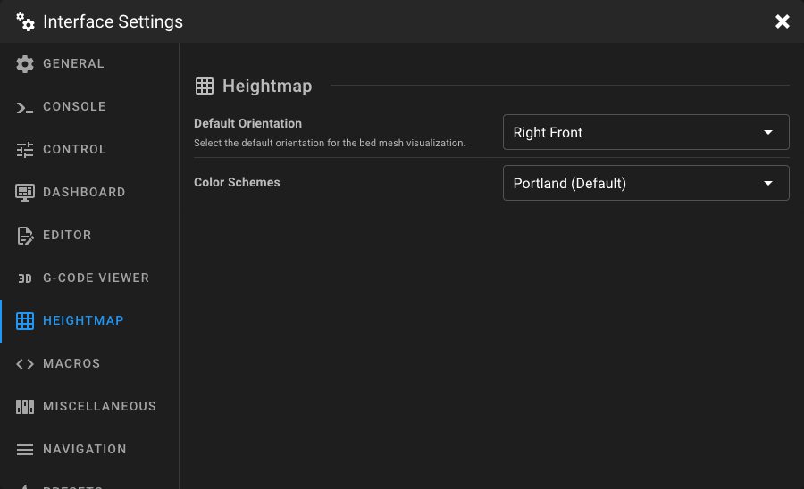

# Heightmap Settings

Open the **Interface Settings** by clicking the **cogs icon** in the top-right corner, then navigate to **Heightmap**.

<figure markdown="span">
  
</figure>

## Default Orientation

Select the default viewing angle for the bed mesh visualization.

| Option          | Description                                   |
|-----------------|-----------------------------------------------|
| **Right Front** | View the mesh from the right-front corner.    |
| **Left Front**  | View the mesh from the left-front corner.     |
| **Front**       | View the mesh straight from the front.        |
| **Top**         | View the mesh from directly above (top-down). |

## Color Scheme

Choose the color scheme used to visualize height differences in the bed mesh.

| Option                   | Description                                                    |
|--------------------------|----------------------------------------------------------------|
| **Portland** *(default)* | Blue-to-red gradient — blue for low areas, red for high areas. |
| **Spring**               | Magenta-to-yellow gradient.                                    |
| **Hot**                  | Black through red and yellow to white.                         |
| **HSV**                  | Full hue spectrum (rainbow).                                   |
| **Grayscale**            | Black-to-white gradient.                                       |
