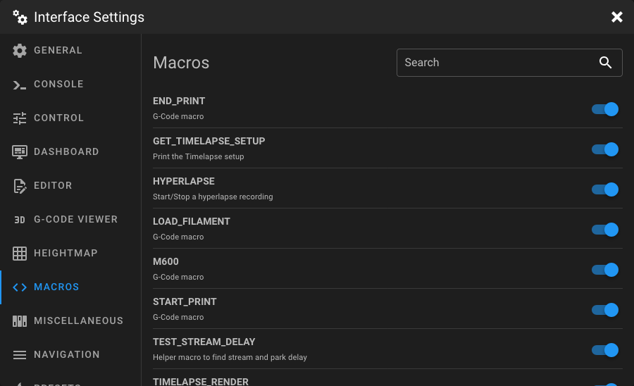
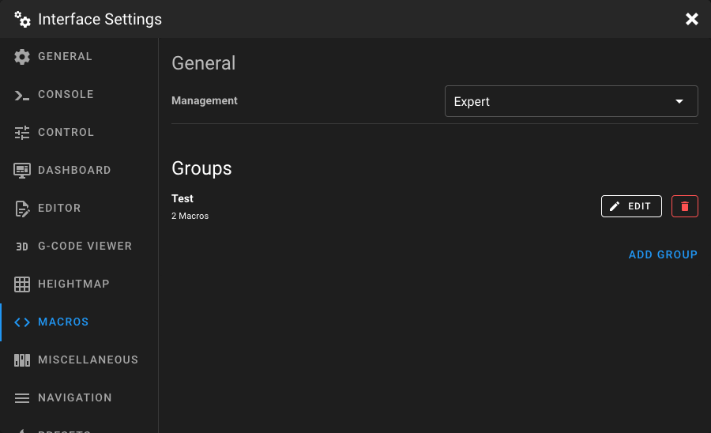
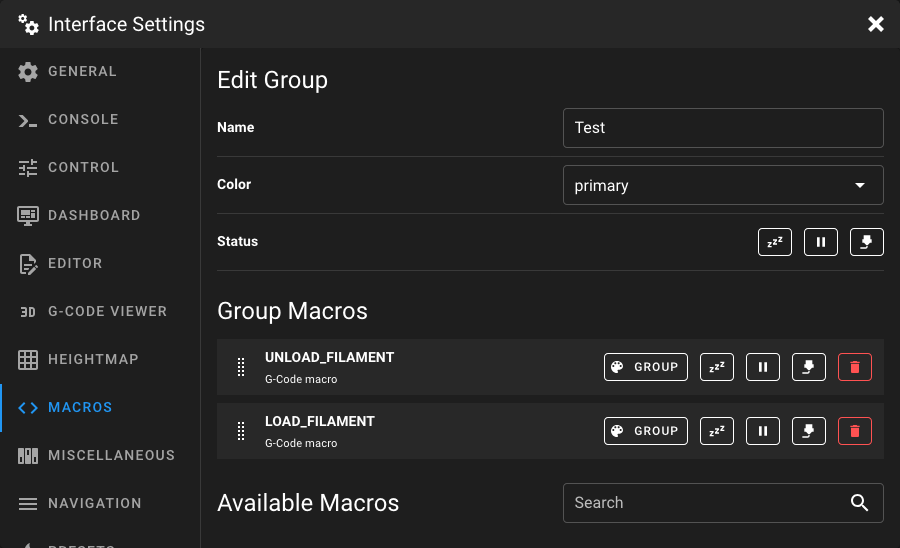

# Macros Settings

Open the **Interface Settings** by clicking the **cogs icon** in the top-right corner, then navigate to **Macros**.

<figure markdown="span">

</figure>

## Management Mode

At the top, select the management mode that suits your needs:

| Mode                   | Description                                                                                                                                |
|------------------------|--------------------------------------------------------------------------------------------------------------------------------------------|
| **Simple** *(default)* | Toggle macro visibility. All visible macros are shown alphabetically in a single panel on the Dashboard.                                   |
| **Expert**             | Create custom groups, each displayed as a separate panel on the Dashboard. Full control over colors, ordering, and state-based visibility. |

---

## Simple Mode

In Simple mode, all your Klipper G-Code macros are listed alphabetically. Each macro has a
toggle switch to show or hide it on the Dashboard.

<figure markdown="span">

</figure>

Use the **Search** field to quickly find macros by name or description.

!!! tip
    Macros that start with an underscore (e.g. `_MY_HELPER`) are hidden by default in Klipper. These macros will not
    appear in the list.

---

## Expert Mode

Expert mode gives you full control over how macros are organized and displayed on the Dashboard. Instead of a single
alphabetical list, you create **groups**. Each group appears as a separate panel on the Dashboard and can be positioned
independently via the [Dashboard settings](dashboard.md).

<figure markdown="span">

</figure>

### Creating a Group

Click **Add Group** to create a new macro group. This immediately opens the group editor.

### Editing a Group

Click the **Edit** button next to a group to open the group editor. Here you can configure the group settings and manage
which macros belong to the group.

<figure markdown="span">

</figure>

#### Name

Enter a unique name for the group. This name is displayed as the panel title on the Dashboard.

#### Color

Set the default button color for all macros in this group.

| Option        | Description                               |
|---------------|-------------------------------------------|
| **primary**   | Primary theme color.                      |
| **secondary** | Secondary theme color.                    |
| **success**   | Green.                                    |
| **warning**   | Orange/yellow.                            |
| **error**     | Red.                                      |
| **custom**    | Opens a color picker to choose any color. |

#### Status Visibility

Control when this group panel is visible on the Dashboard based on the printer state. Toggle each state independently:

| State        | Description                                |
|--------------|--------------------------------------------|
| **Standby**  | Show the group when the printer is idle.   |
| **Paused**   | Show the group when the printer is paused. |
| **Printing** | Show the group while a print is running.   |

### Managing Macros in a Group

The **Group Macros** section shows all macros currently assigned to this group.

#### Adding Macros

The **Available Macros** section below lists all macros not yet assigned to this group. Click **Add** to assign a macro
to the group. Use the **Search** field to filter by name or description.

#### Reordering Macros

Drag and drop macros using the drag handle to change their order within the group.

#### Per-Macro Settings

Each macro in the group has individual settings:

| Setting      | Description                                                                                                                                                                                  |
|--------------|----------------------------------------------------------------------------------------------------------------------------------------------------------------------------------------------|
| **Color**    | Cycle through the available button colors by clicking the color button. Choose **group** to inherit the group color, or pick a specific color (primary, secondary, success, warning, error). |
| **Standby**  | Show or hide this macro when the printer is idle.                                                                                                                                            |
| **Paused**   | Show or hide this macro when the printer is paused.                                                                                                                                          |
| **Printing** | Show or hide this macro while a print is running.                                                                                                                                            |

#### Removing Macros

Click the delete button to remove a macro from the group. The macro is not deleted from Klipper, it simply removed
visually from the group.

### Deleting a Group

Click the delete button next to a group in the group list to remove it entirely.
