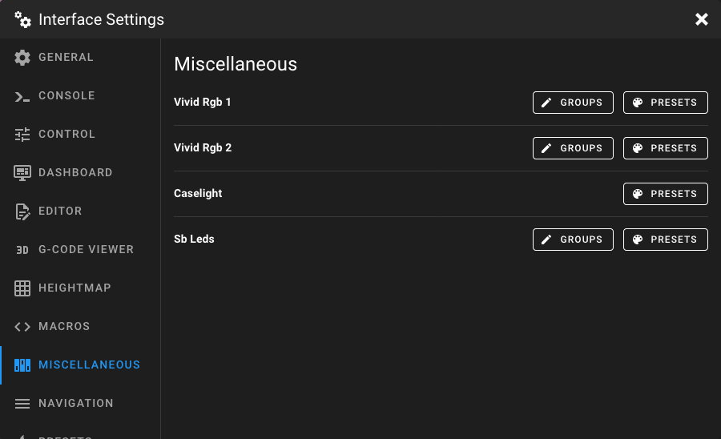
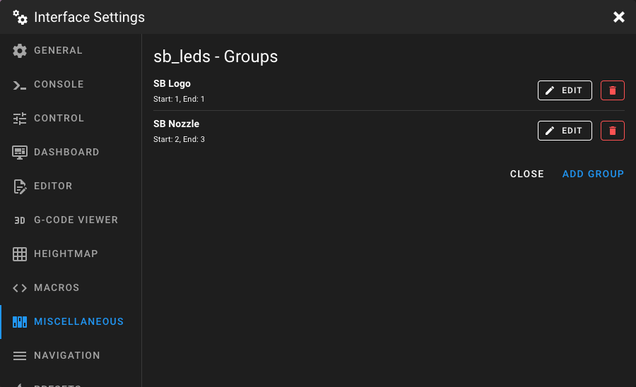
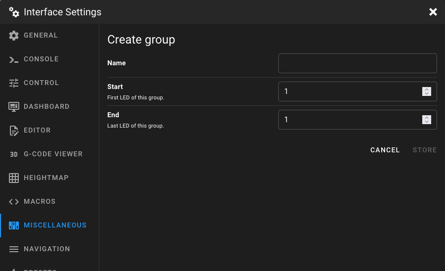
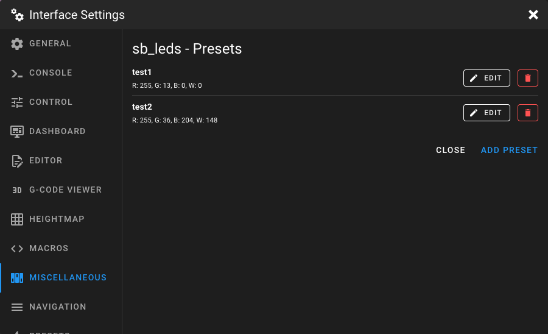
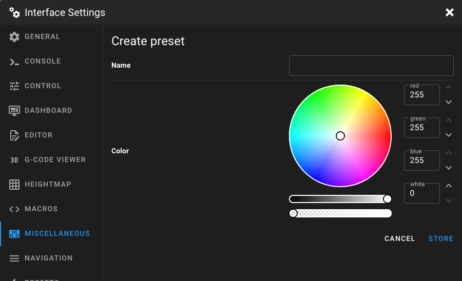

# Miscellaneous Settings

Open the **Interface Settings** by clicking the **cogs icon** in the top-right corner, then navigate to
**Miscellaneous**.

<figure markdown="span">
  
</figure>

This page lists all LED and light devices from your Klipper configuration that have a color order defined (e.g.
`neopixel`, `dotstar`, or `led` with color pins). Each device shows its name and offers buttons to manage **Groups** and
**Presets**.

!!! note
    If no LED devices are configured in Klipper, the page displays "No devices found".

## Groups

Groups allow you to control a subset of LEDs in an addressable LED chain independently. The **Groups** button is only
available for devices with a `chain_count` greater than 1.

<figure markdown="span">
  
</figure>

Click **Groups** on a device to see its group list, then click **Add Group** to create a new one.

<figure markdown="span">
  
</figure>

### Name

Enter a unique name for the group. This name is used on the Dashboard to identify the group and control its color
settings.

### Start

The index of the first LED in this group. Must be greater than 0 and less than or equal to the total number of LEDs in
the chain.

### End

The index of the last LED in this group. Must be greater than or equal to the start value and less than or equal to the
total number of LEDs in the chain.

## Presets

Presets let you save color configurations for a light device and quickly apply them later from the Dashboard.

<figure markdown="span">
  
</figure>

Click **Presets** on a device to see its preset list, then click **Add Preset** to create a new one.

<figure markdown="span">
  
</figure>

### Name

Enter a unique name for the preset (e.g. "Work Light", "Night Mode", "Off").

### Color

Set the color values for the preset. The available color channels depend on the device's color order:

| Channel   | Range   | Description                                      |
|-----------|---------|--------------------------------------------------|
| **Red**   | 0 – 255 | Red channel intensity.                           |
| **Green** | 0 – 255 | Green channel intensity.                         |
| **Blue**  | 0 – 255 | Blue channel intensity.                          |
| **White** | 0 – 255 | White channel intensity (only for RGBW devices). |

If the device supports full RGB, a color wheel and brightness slider are shown for easy color
selection. For devices with a white channel, an additional opacity slider controls the white
intensity.
