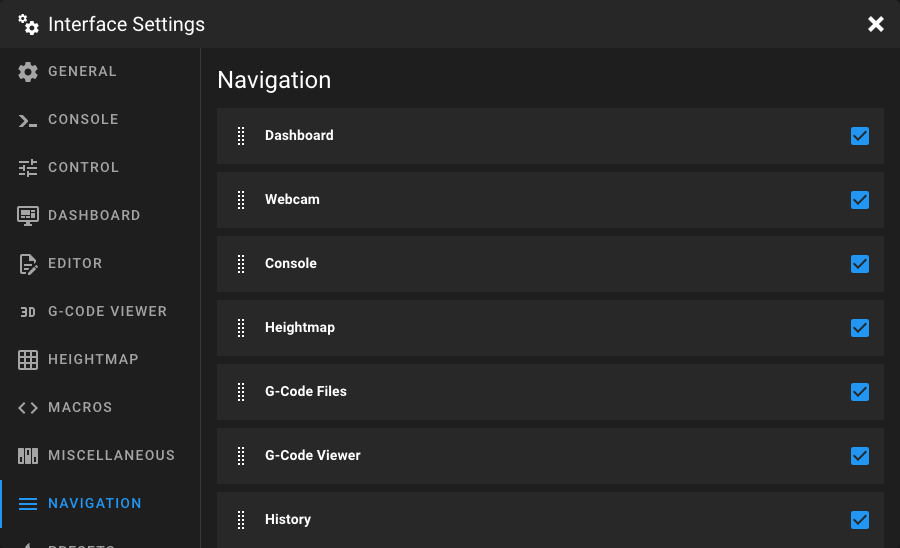

# Navigation Settings

Open the **Interface Settings** by clicking the **cogs icon** in the top-right corner, then
navigate to **Navigation**.

<figure markdown="span">

</figure>

This page lets you customize the sidebar navigation of Mainsail. You can reorder entries and control which ones are
visible.

## Reordering Entries

Drag and drop navigation entries using the drag handle to change their order in the sidebar. The order you set here is
reflected directly in the sidebar navigation.

## Showing and Hiding Entries

Click the checkbox next to an entry to toggle its visibility. Hidden entries are not shown in the sidebar but remain in
the settings list, so you can re-enable them at any time.

## Navigation Entry Types

The navigation list can contain two types of entries:

| Type | Description |
|------|-------------|
| **Page** | Built-in Mainsail pages like Dashboard, Console, Heightmap, or G-Code Files. Which pages are available depends on your Klipper and Moonraker configuration. |
| **Link** | Custom external links defined via a `.theme/navi.json` file. These entries show their target URL as a subtitle. |

!!! tip
    You can add custom links to the sidebar navigation by creating a `navi.json` file in your `.theme` directory. Learn
    more in the [Custom Themes](../features/custom-themes.md) documentation.

!!! note
    Some navigation entries only appear when the corresponding feature is available. For example, the **Webcam** entry
    is only shown if at least one webcam is configured, and the **Timelapse** entry requires the Timelapse Moonraker
    component.
