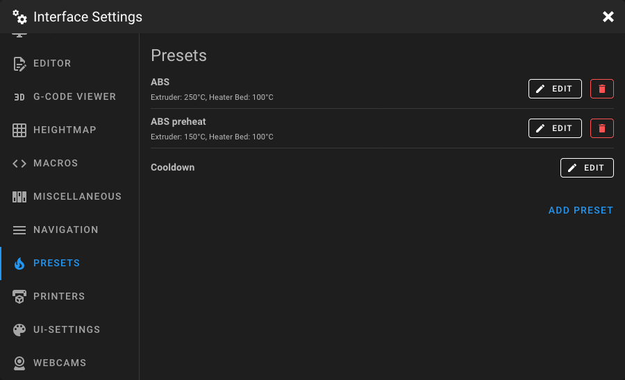
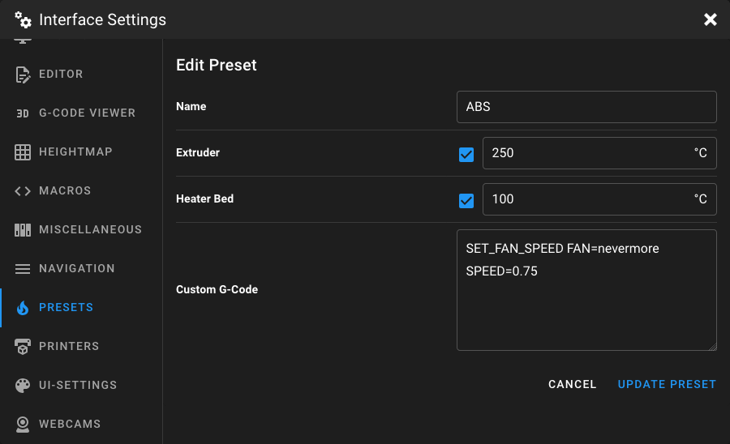

# Presets Settings

Open the **Interface Settings** by clicking the **cogs icon** in the top-right corner, then navigate to **Presets**.

<figure markdown="span">

</figure>

## Preheat Presets

Preheat presets let you quickly set target temperatures for your heaters and optionally execute custom G-Code. Click
**Add Preset** to create a new preset, or click **Edit** on an existing one to modify it.

<figure markdown="span">

</figure>

!!! note
    Each preset requires at least one enabled temperature or a custom G-Code command.

### Name

Enter a unique name for the preset, usually the filament type (PLA, PETG, ABS), color, or any other descriptive text.

### Temperatures

Set the desired target temperature for each available heater. The list is dynamically built from your Klipper
configuration and may include:

- **Extruder**: Target temperature for the hotend
- **Heater Bed**: Target temperature for the heated bed
- **Heater Generic**: Any additional heaters (e.g. chamber heater)
- **Temperature Fan**: Temperature-controlled fans

Each heater has a checkbox to enable or disable it for this preset. Disabled heaters are not changed when the preset is
applied.

### Custom G-Code

Optionally, add custom G-Code that is executed after the temperatures are set. This is useful for:

- Setting Z-offset for different print surfaces
- Enabling or disabling fans
- Running preparation macros

### Deleting a Preset

Click the delete button next to a preset in the list to remove it.

## Cooldown

The **Cooldown** entry is always present at the bottom of the preset list. When triggered, it sets all heater targets to
0°C. Click **Edit** to add custom G-Code that is executed alongside the cooldown. For example, `M107` to turn off the
part cooling fan.

<figure markdown="span">

</figure>

## Examples

### Filament Preheat Preset

A typical PLA preheat preset:

| Setting    | Value     |
|------------|-----------|
| Name       | PLA       |
| Extruder   | 200°C     |
| Heater Bed | 60°C      |
| G-Code     | *(empty)* |

### Z-Offset Preset

Use custom G-Code to switch between different Z-offsets for various print surfaces without changing any temperatures:

| Setting    | Value                    |
|------------|--------------------------|
| Name       | Textured PEI             |
| Extruder   | *(disabled)*             |
| Heater Bed | *(disabled)*             |
| G-Code     | `SET_GCODE_OFFSET Z=0.2` |

Replace `0.2` with the Z-offset value you require for your print surface.
