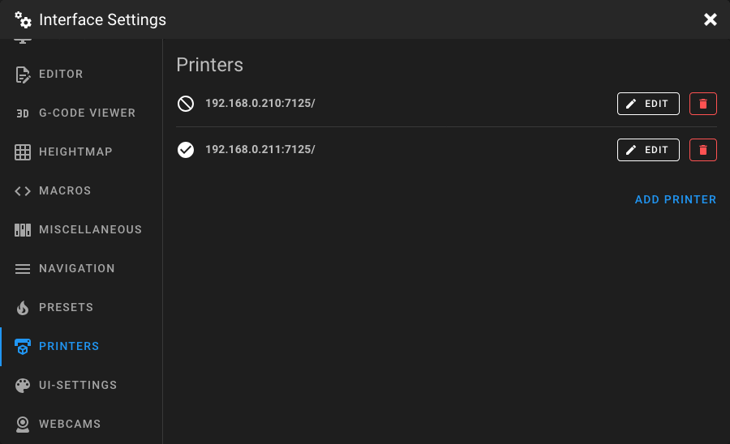
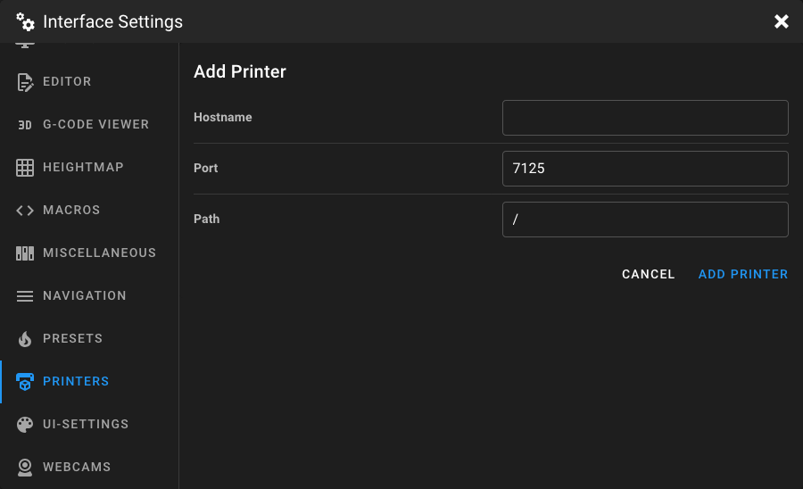
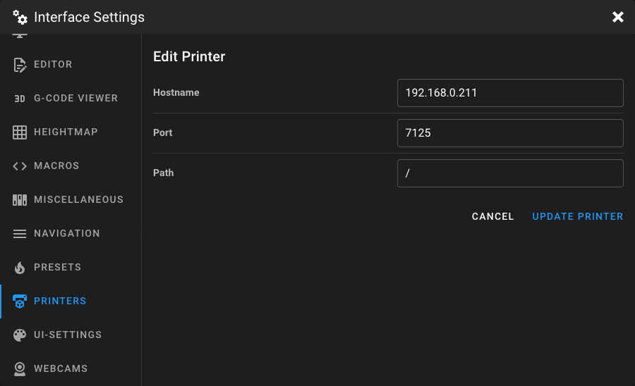

# Printers Settings

Open the **Interface Settings** by clicking the **cogs icon** in the top-right corner, then navigate to **Printers**.

<figure markdown="span">
  
</figure>

This page lets you manage remote printers. Adding multiple printers enables you to switch between Klipper instances
directly from the Mainsail interface and use the print farm overview.

## Adding a Printer

Click **Add Printer** to open the printer form and enter the connection details.

<figure markdown="span">
  
</figure>

### Hostname

The hostname or IP address of the remote printer's Moonraker instance. Do not include the
protocol prefix (`http://` or `https://`).

**Examples:** `192.168.1.100`, `my-printer.local`

### Port

The port number of the Moonraker instance. The default Moonraker port is `7125`.

### Path

The URL path prefix for the Moonraker instance. Must start with `/`. The default is `/`.

This is useful when Moonraker is served behind a reverse proxy under a subpath, for example `/printer1`.

## Editing a Printer

Click the **Edit** button next to a printer to modify its connection details.

<figure markdown="span">
  
</figure>

## Deleting a Printer

Click the delete button next to a printer to remove it from the list.
