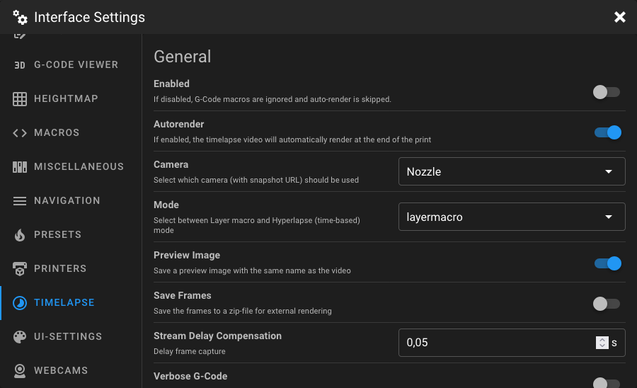

# Timelapse Settings

Open the **Interface Settings** by clicking the **cogs icon** in the top-right corner, then navigate to **Timelapse**.

<figure markdown="span">

</figure>

!!! note
    This settings tab is only available when the
    [Moonraker Timelapse](https://github.com/mainsail-crew/moonraker-timelapse){:target="_blank"} component is
    installed. Some settings may be disabled if they are already defined in the Moonraker configuration file
    (`moonraker.conf`).

## General

### Enabled

When enabled, the timelapse G-Code macros are active and auto-render runs at the end of a print. When disabled, all
timelapse macros are ignored and auto-render is skipped.

### Autorender

When enabled, the timelapse video is automatically rendered at the end of the print.

### Camera

Select which webcam should be used for capturing timelapse frames. Only webcams that have a snapshot URL configured in
the [Webcams settings](webcams.md) are shown.

!!! warning
    If the `snapshoturl` is already set in the `[timelapse]` section of your Moonraker configuration, this dropdown is
    replaced by a warning. Remove the `snapshoturl` from `moonraker.conf` to use the camera selection in the UI.

### Mode

Select the capture mode for the timelapse.

| Mode                       | Description                                                                                                                                         |
|----------------------------|-----------------------------------------------------------------------------------------------------------------------------------------------------|
| **layermacro** *(default)* | A snapshot is taken at each layer change via the `TIMELAPSE_TAKE_FRAME` macro. Requires the macro to be added to your slicer's layer change G-Code. |
| **hyperlapse**             | A snapshot is taken at a fixed time interval, regardless of layer changes.                                                                          |

### Hyperlapse Cycle Time

The interval (in seconds) between snapshots in hyperlapse mode. Only visible when **Mode** is set to `hyperlapse`.

### Preview Image

When enabled, a preview image is saved alongside the rendered video with the same filename.

### Save Frames

When enabled, all captured frames are saved as a zip file for external rendering or post-processing.

### Stream Delay Compensation

Delay (in seconds) before capturing a frame. This compensates for stream delay, ensuring the captured image matches the
actual print state. Must be 0 or greater.

### Verbose G-Code

When enabled, the timelapse G-Code macros output information to the console, which can be helpful for debugging.

---

## Park Toolhead

### Park Toolhead

When enabled, the toolhead is moved to a defined parking position before each frame is captured. This ensures consistent
framing and avoids the nozzle appearing in the image.

!!! tip
    Enabling park toolhead is recommended for the best timelapse results, as it ensures the toolhead is not visible in
    the captured frames.

### Park Position

Select where the toolhead should park before capturing a frame.

| Position        | Description                                       |
|-----------------|---------------------------------------------------|
| **center**      | Parks at the center of the build plate.           |
| **front_left**  | Parks at the front-left corner.                   |
| **front_right** | Parks at the front-right corner.                  |
| **back_left**   | Parks at the back-left corner.                    |
| **back_right**  | Parks at the back-right corner.                   |
| **x_only**      | Parks only along the X axis at a custom position. |
| **y_only**      | Parks only along the Y axis at a custom position. |
| **custom**      | Parks at fully custom X and Y coordinates.        |

### Position X

The absolute X coordinate (in mm) for the park position. Only visible when park position is set to `x_only` or `custom`.
Must be within your printer's X axis range.

### Position Y

The absolute Y coordinate (in mm) for the park position. Only visible when park position is set to `y_only` or `custom`.
Must be within your printer's Y axis range.

### Position Z

The relative Z movement (in mm) when parking. The toolhead moves up by this amount before parking. Only visible when
park position is set to `x_only`, `y_only`, or `custom`. Must be 0 or greater.

### Travel Speed

The movement speed (in mm/s) used when traveling to the park position and when resuming the print. Must be 0 or greater.

### FW Retract

When enabled, firmware retraction (`G10`/`G11`) is used for retracting and unretracting filament during the parking
move. When disabled, manual retraction settings are shown below.

### Retract Speed

The speed (in mm/s) at which the extruder retracts filament before parking. Only visible when **FW Retract** is
disabled. Must be greater than 0.

### Retract Distance

The length of filament (in mm) that the extruder retracts before parking. Only visible when **FW Retract** is disabled.
Must be 0 or greater.

### Unretract Speed

The speed (in mm/s) at which the extruder unretracts filament after returning from the park position. Only visible when
**FW Retract** is disabled. Must be greater than 0.

### Unretract Distance

The length of filament (in mm) that the extruder unretracts after returning from the park position. Only visible when
**FW Retract** is disabled. Must be 0 or greater.

### Park Time

Additional idle time (in seconds) to wait at the park position before capturing the frame. This can help the camera
autofocus or let vibrations settle. Must be 0 or greater.

---

## Rendering Options

### Variable FPS

When enabled, the framerate of the output video is automatically calculated based on the target video length. When
disabled, a fixed output framerate is used instead.

### Target Length

The desired duration (in seconds) of the rendered timelapse video. The framerate is automatically adjusted to match this
target. Only visible when **Variable FPS** is enabled. Must be greater than 0.

### Variable FPS Min

The minimum framerate (in frames per second) when using variable FPS. Only visible when **Variable FPS** is enabled.
Must be greater than 0.

### Variable FPS Max

The maximum framerate (in frames per second) when using variable FPS. Must be greater than the min value. Only visible
when **Variable FPS** is enabled.

### Output Framerate

The fixed framerate (in frames per second) of the rendered video. Only visible when **Variable FPS** is disabled. Must
be greater than 0.

### Duplicate Last Frame

The number of times the last captured frame is duplicated at the end of the video. This creates a brief pause at the
end, showing the finished print. Must be 0 or greater.

### Constant Rate Factor

Controls the video quality vs. file size tradeoff. The CRF scale ranges from 0 to 51:

| Value              | Quality                                          |
|--------------------|--------------------------------------------------|
| **0**              | Lossless                                         |
| **17 – 18**        | Visually lossless (recommended for high quality) |
| **23** *(default)* | Good balance of quality and file size            |
| **28**             | Lower quality, smaller file                      |
| **51**             | Worst quality                                    |

A lower value produces higher quality but larger files.

### Pixel Format

Defines the pixel format of the output video. The default is `yuv420p`, which provides broad compatibility across video
players and devices.

### Time Format Code

Defines how the timestamp in the output filename is formatted. Uses Python `strftime` format codes(e.g.
`%Y%m%d_%H%M%S`).

### Extra Output Params

Additional output parameters passed directly to FFmpeg. This allows advanced users to customize the rendering pipeline.

!!! warning
    Specifying extra output parameters will disable the automatic rotation setting applied by the timelapse plugin.
