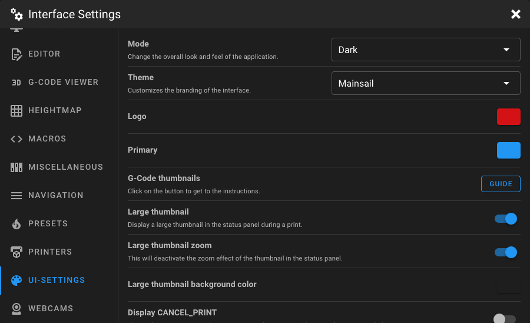

# UI Settings

Open the **Interface Settings** by clicking the **cogs icon** in the top-right corner, then navigate to **UI-Settings**.

<figure markdown="span">

</figure>

## Mode

Change the overall look and feel of the application.

| Option               | Description                      |
|----------------------|----------------------------------|
| **Dark** *(default)* | Dark background with light text. |
| **Light**            | Light background with dark text. |

## Theme

Customize the branding of the interface. Selecting a theme may update the default logo and primary colors. There are a
couple of built-in themes available. To find more information about the available themes, check the
[Themes documentation](../features/built-in-themes.md).

## Logo Color

Change the color of the Mainsail logo (or the current logo from your theme) displayed in the top-left corner and in the
browser tab. Use the color picker to select a custom color. Click the reset button to restore the theme default color.

## Primary Color

Change the color of all primary UI elements such as buttons, links, and other interactive elements. Use the color picker
to select a custom color. Click the reset button to restore the theme default color.

## G-Code Thumbnails

A link to the [Thumbnails](../features/thumbnails.md) documentation, which explains how to configure your slicer to
generate G-Code thumbnails.

## Large Thumbnail

When enabled, a large thumbnail image is displayed in the status panel during a print. When disabled, only a small icon
is shown. (If a thumbnail is available for the current print job)

### Large Thumbnail Zoom

When enabled, the large thumbnail has a zoom effect in the status panel. Disable this to show the complete thumbnail
without zoom effect. This option is only visible when **Large Thumbnail** is enabled.

### Large Thumbnail Background Color

Set the background color behind the large thumbnail using the color picker. This option is only visible when **Large
Thumbnail** is enabled. Click the reset button to restore the default.

## Display CANCEL_PRINT

When enabled, the `CANCEL_PRINT` button is shown permanently during a print and no second-layer confirmation is needed.
When disabled, you need to confirm cancellation through an additional step to `PAUSE` the print first.

## Show Progress as Favicon

When enabled, the Mainsail logo favicon in the browser tab is replaced with a progress circle during printing.

## Lock Sliders on Touchscreen Devices

When enabled, sliders on touchscreen devices need to be unlocked before changes are allowed. This prevents accidental
adjustments when scrolling on touchscreen devices.

### Slider Lock Delay

Set the delay (in seconds) after which sliders automatically lock again. If set to `0` or left blank, sliders only lock
on page change or reload. This option is only visible when **Lock Sliders on Touchscreen Devices** is enabled.

## Require Confirm on Emergency Stop

When enabled, a confirmation dialog is shown when you click the Emergency Stop button, preventing accidental activation.

## Require Confirm on Cooldown

When enabled, a confirmation dialog is shown before executing the cooldown preset, preventing accidental temperature
changes during or after a print.

## Require Confirm on Device Power Changes

When enabled, a confirmation dialog is shown before toggling Moonraker power devices on or off.

## Require Confirm on Cancel Job

When enabled, a confirmation dialog is shown before cancelling a print job.

## Navigation Style

Change the appearance of the sidebar navigation.

| Option                       | Description                                               |
|------------------------------|-----------------------------------------------------------|
| **Icons + Text** *(default)* | Displays an icon and the name of each navigation entry.   |
| **Icons only**               | Displays only icons, taking up less space in the sidebar. |

## Navigation Default State

Control whether the sidebar navigation is open or closed when Mainsail loads.

| Option                     | Description                                           |
|----------------------------|-------------------------------------------------------|
| **always open**            | The sidebar is always expanded on page load.          |
| **always closed**          | The sidebar is always collapsed on page load.         |
| **last state** *(default)* | Restores the sidebar state from the previous session. |

## Hide Upload and Print Button

When enabled, the **Upload and Print** button in the top bar is hidden. This can be useful to prevent accidental prints
when you only want to upload files.

## Printer Power Device

Select which Moonraker power device should be used to power on the printer. The default (**Auto**) automatically selects
a device named `printer` if one exists.

## Hide SAVE_CONFIG Button for bed_mesh Changes

When enabled, the `SAVE_CONFIG` button is hidden if only `bed_mesh` changes are pending to be saved in Klipper. This is
useful if you don't want to permanently save bed mesh data after each probe.

## Disable Fan Animation

When enabled, the spinning fan icon animation is disabled. This can reduce browser load, especially on lower-powered
clients.

## Manual Probe Helper Dialog

When enabled, a helper dialog is displayed when running `PROBE_CALIBRATE` or `Z_ENDSTOP_CALIBRATE`, guiding you through 
the manual probe process.

## Bed Screws Dialog

When enabled, a helper dialog is displayed when running `BED_SCREWS_ADJUST`, showing which screw to adjust and by how
much.

## Screws Tilt Adjust Dialog

When enabled, a helper dialog is displayed when running `SCREWS_TILT_CALCULATE`, showing the calculated adjustments for
each screw.

## Height Temperature Chart

Set the height (in pixels) of the temperature chart on the Dashboard. The value can be set between **100 px** and **500
px** using the slider.

## Hide Update Warnings

When enabled, all update warnings in the update manager are hidden. Enable this if you intentionally run older versions
and don't want to see update notifications.

## Dashboard Files Limit

Set the maximum number of files displayed in the Dashboard status panel. Use the slider to select a value between **0**
and **10**. Setting this to `0` hides the files tab entirely.

## Dashboard Files Filter

Filter the files shown in the Dashboard status panel by their last print status:

| Option        | Description                                    |
|---------------|------------------------------------------------|
| **New**       | Files that have not been printed yet.          |
| **Failed**    | Files whose last print failed.                 |
| **Completed** | Files whose last print completed successfully. |

You can select multiple filters. If no filter is selected, all files are shown.

## Dashboard History Limit

Set the maximum number of print jobs displayed in the Dashboard status panel. Use the slider to select a value between
**0** and **10**. Setting this to `0` hides the history tab entirely.

## Hide Other Instances

When enabled, other instances of Klipper and Moonraker are hidden in the service menu. This is useful in multi-instance
setups where you only want to see the current instance.
